# 1、开通阿里云

## 1.1 注册登录

访问阿里云主页：[阿里云](https://www.aliyun.com/)


注册：

 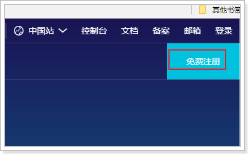

登录：

 

进入云通信：

 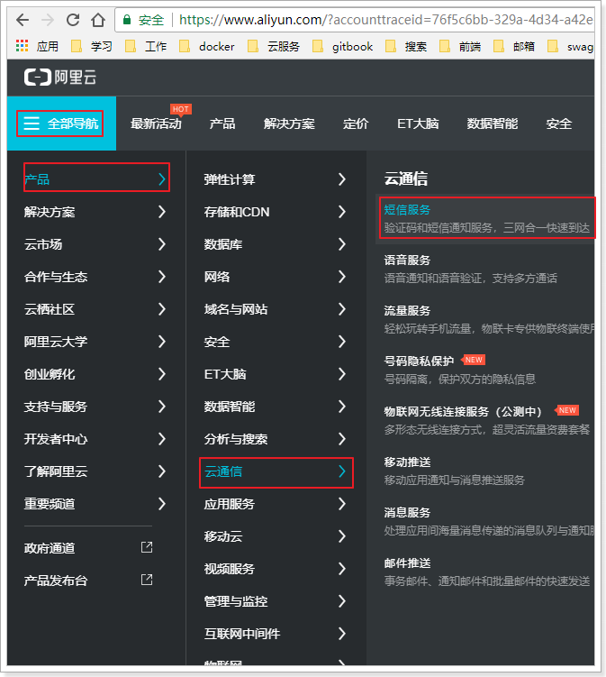

进入短信服务控制台：

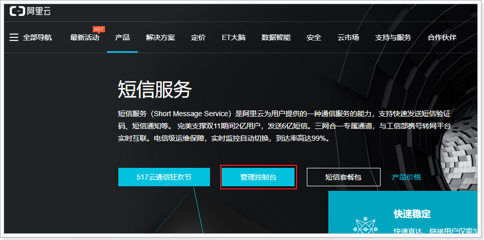


选择：已阅读协议，然后立即开通


然后在控制台，即可查看新手帮助：


## 1.2 完整流程

查看新手帮助的完整流程：

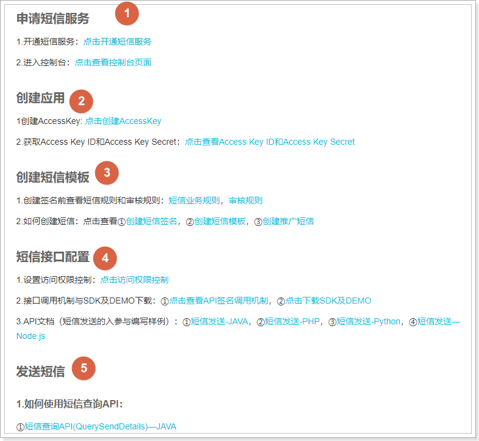


申请短信服务我们已经完成，下一步就是创建应用：


## 1.3 创建AccessKey

首先，生成AccessKey：

 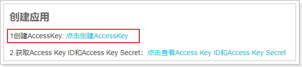

点击后，进入新的帮助页面：

 

操作步骤：

- 登录[RAM管理控制台](https://ram.console.aliyun.com/)。

  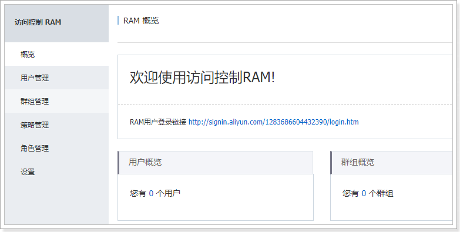

- 在左侧导航栏，单击**用户管理**。

  

  然后点击新建用户：

   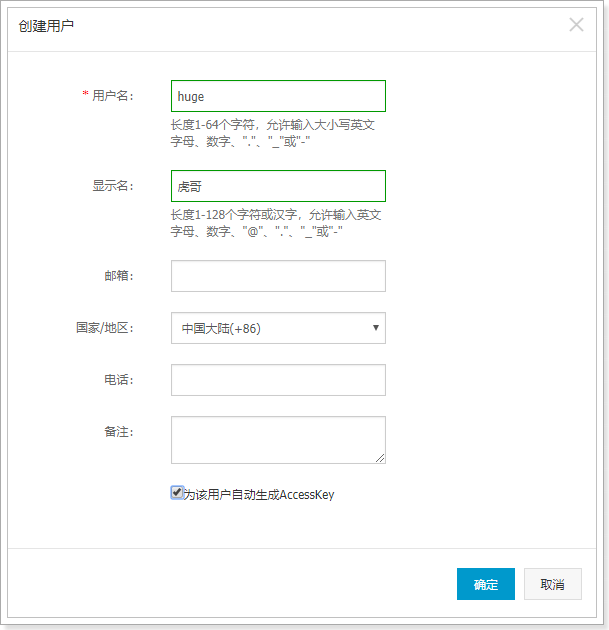

- 填写信息，点击确定：

   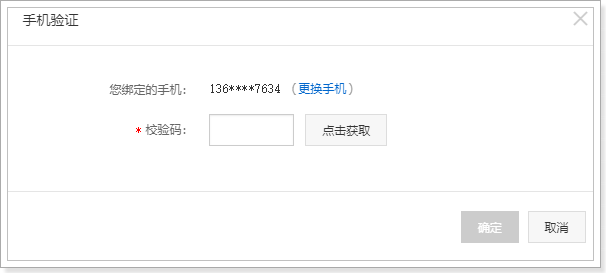

- 在验证手机成功：

   

- 在弹出的对话框中，展开**AccessKey详情**查看查看AcessKeyId和AccessKeySecret。然后单击**保存AK信息**，下载AccessKey信息。

   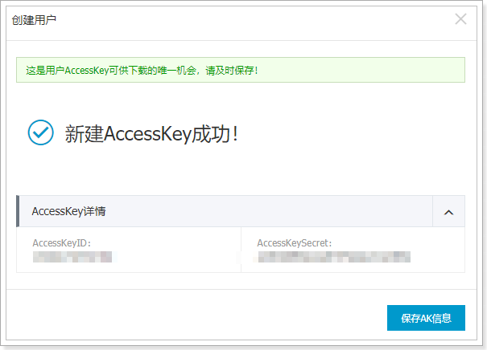

## 1.4 给用户授权

点击右侧的用户授权：

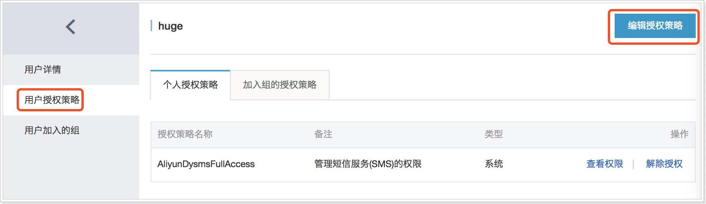


然后添加短信授权：


## 1.5 创建短信签名

短信签名就是短信内容头部的标签，标注短信发送者的身份。

点击管理界面的签名管理：


点击添加签名：

 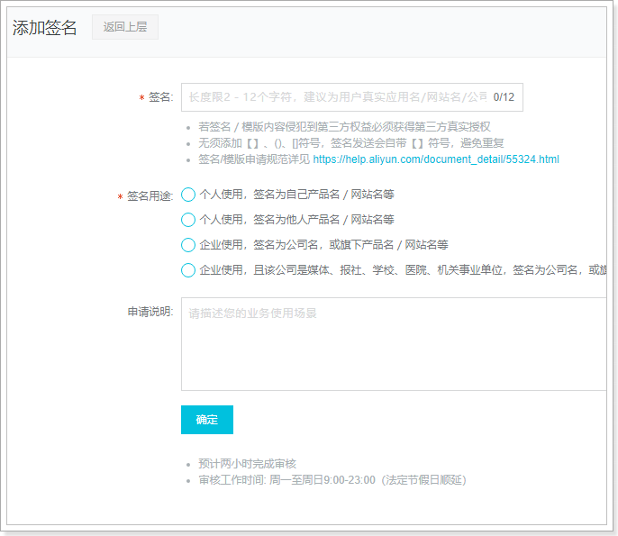

填写信息后点击确定，进入审核状态：

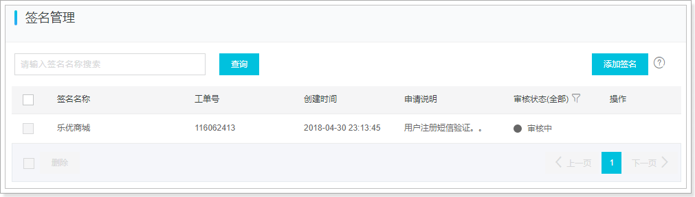


## 1.6 申请模板

在右侧点击模板管理：然后添加模板


填写模板信息：

 


进入审核状态：


# 2、java客户端

我们通过官网提供的帮助来完成java客户端学习：

 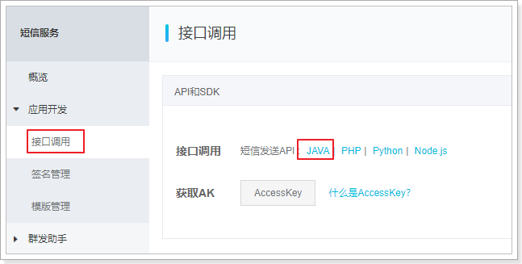

## 2.1.下载SDK工具包


下载完成后得到压缩包：

 

解压后目录结构：

 

它这里提供的案例代码比较老，jdk版本也比较低。

## 2.2.安装SDK

我们需要把api_SDK中的两个依赖装入本地maven中，进入api_sdk目录，有两个项目需要处理：

 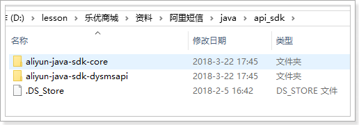


然后进入到项目根目录：

 

打开cmd命令行，输入命令：

```powershell
mvn install -Dmaven.test.skip=true -Dgpg.skip=true
```

然后进入另一个项目，上面的操作执行一遍

## 2.3.demo

建议大家直接使用课前资料提供的demo工程：

 

导入到idea中：

 

### 2.3.1.填写AccessKey：

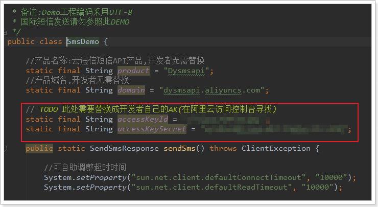

这里要填写刚刚申请的AccessKey的id和secret：

### 2.3.2.填写电话及短信模板

 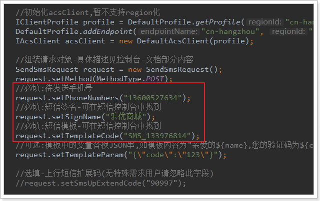

这里要修改3个地方：

- phoneNumber：发送的目标手机
- signName：签名名称，这个去控制台查看
- templateCode：模板id，也去控制台查看

运行main函数测试：

 

短信发送成功了：

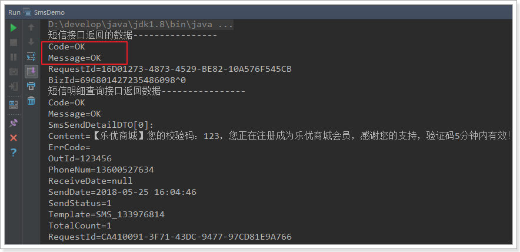

效果：

 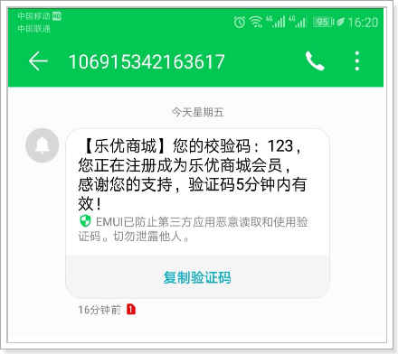

