# 0.学习目标

- 会调用订单系统接口
- 实现订单结算功能
- 实现微信支付功能


# 1.订单系统接口

我们不做开发，只讲解

## 1.1.导入订单服务

把课前资料提供的`ly-order`复制到`D:\heima\code\leyou`目录。

然后在工程内导入：

 

然后导入module：

 

选择导入module：

 

选择目录中的 `ly-order`：

 

打开父工程leyou的pom文件，添加`ly-order`模块：


## 1.2.Swagger-UI

丝袜哥

### 1.2.1.什么是OpenAPI

随着互联网技术的发展，现在的网站架构基本都由原来的后端渲染，变成了：前端渲染、前后端分离的形态，而且前端技术和后端技术在各自的道路上越走越远。  前端和后端的唯一联系，变成了API接口；API文档变成了前后端开发人员联系的纽带，变得越来越重要。

没有API文档工具之前，大家都是手写API文档的，在什么地方书写的都有，而且API文档没有统一规范和格式，每个公司都不一样。这无疑给开发带来了灾难。

OpenAPI规范（OpenAPI Specification 简称OAS）是Linux基金会的一个项目，试图通过定义一种用来描述API格式或API定义的语言，来规范RESTful服务开发过程。目前V3.0版本的OpenAPI规范已经发布并开源在github上 。

官网：https://github.com/OAI/OpenAPI-Specification

### 1.2.2.什么是swagger？

OpenAPI是一个编写API文档的规范，然而如果手动去编写OpenAPI规范的文档，是非常麻烦的。而Swagger就是一个实现了OpenAPI规范的工具集。

官网：https://swagger.io/

看官方的说明：

 

Swagger包含的工具集：

- **Swagger编辑器：** Swagger Editor允许您在浏览器中编辑YAML中的OpenAPI规范并实时预览文档。
- **Swagger UI：** Swagger UI是HTML，Javascript和CSS资产的集合，可以从符合OAS标准的API动态生成漂亮的文档。
- **Swagger Codegen：**允许根据OpenAPI规范自动生成API客户端库（SDK生成），服务器存根和文档。
- **Swagger Parser：**用于解析来自Java的OpenAPI定义的独立库
- **Swagger Core：**与Java相关的库，用于创建，使用和使用OpenAPI定义
- **Swagger Inspector（免费）：** API测试工具，可让您验证您的API并从现有API生成OpenAPI定义
- **SwaggerHub（免费和商业）：** API设计和文档，为使用OpenAPI的团队构建。

### 1.2.3.快速入门

SpringBoot已经集成了Swagger，使用简单注解即可生成swagger的API文档。

#### 1）引入依赖

```xml
<dependency>
    <groupId>io.springfox</groupId>
    <artifactId>springfox-swagger2</artifactId>
    <version>2.8.0</version>
</dependency>
<dependency>
    <groupId>io.springfox</groupId>
    <artifactId>springfox-swagger-ui</artifactId>
    <version>2.8.0</version>
</dependency>
```

#### 2）编写配置

```java
@Configuration
@EnableSwagger2
public class SwaggerConfig {
    @Bean
    public Docket api() {
        return new Docket(DocumentationType.SWAGGER_2)
                .host("http://order.leyou.com")
                .apiInfo(apiInfo())
                .select()
                .apis(RequestHandlerSelectors.basePackage("com.leyou.order.controller"))
                .paths(PathSelectors.any())
                .build();
    }

    private ApiInfo apiInfo() {
        return new ApiInfoBuilder()
                .title("乐优商城订单系统")
                .description("乐优商城订单系统接口文档")
                .version("1.0")
                .build();
    }
}
```

#### 3）接口声明

在controller的每个handler上添加接口说明注解：

```java
@RestController
@RequestMapping("order")
@Api("订单服务接口")
public class OrderController {

    @Autowired
    private OrderService orderService;

    @Autowired
    private PayHelper payHelper;

    /**
     * 创建订单
     *
     * @param order 订单对象
     * @return 订单编号
     */
    @PostMapping
    @ApiOperation(value = "创建订单接口，返回订单编号", notes = "创建订单")
    @ApiImplicitParam(name = "order", required = true, value = "订单的json对象,包含订单条目和物流信息")
    public ResponseEntity<Long> createOrder(@RequestBody @Valid Order order) {
        Long id = this.orderService.createOrder(order);
        return new ResponseEntity<>(id, HttpStatus.CREATED);
    }

    /**
     * 分页查询当前用户订单
     *
     * @param status 订单状态
     * @return 分页订单数据
     */
    @GetMapping("list")
    @ApiOperation(value = "分页查询当前用户订单，并且可以根据订单状态过滤", 
                  notes = "分页查询当前用户订单")
    @ApiImplicitParams({
        @ApiImplicitParam(name = "page", value = "当前页", 
                          defaultValue = "1", type = "Integer"),
        @ApiImplicitParam(name = "rows", value = "每页大小", 
                          defaultValue = "5", type = "Integer"),
        @ApiImplicitParam(
            name = "status", 
            value = "订单状态：1未付款，2已付款未发货，3已发货未确认，4已确认未评价，5交易关闭，6交易成功，已评价", type = "Integer"),
    })
    public ResponseEntity<PageResult<Order>> queryUserOrderList(
        @RequestParam(value = "page", defaultValue = "1") Integer page,
        @RequestParam(value = "rows", defaultValue = "5") Integer rows,
        @RequestParam(value = "status", required = false) Integer status) {
        PageResult<Order> result = this.orderService.queryUserOrderList(page, rows, status);
        if (result == null) {
            return new ResponseEntity<>(HttpStatus.NOT_FOUND);
        }
        return ResponseEntity.ok(result);
    }
}
```

常用注解说明：

```java
/**
 @Api：修饰整个类，描述Controller的作用
 @ApiOperation：描述一个类的一个方法，或者说一个接口
 @ApiParam：单个参数描述
 @ApiModel：用对象来接收参数
 @ApiProperty：用对象接收参数时，描述对象的一个字段
 @ApiResponse：HTTP响应其中1个描述
 @ApiResponses：HTTP响应整体描述
 @ApiIgnore：使用该注解忽略这个API
 @ApiError ：发生错误返回的信息
 @ApiImplicitParam：一个请求参数
 @ApiImplicitParams：多个请求参数
 */
```

#### 4）启动测试

启动服务，然后访问：http://localhost:8089/swagger-ui.html

 

点击order-controller，查看接口信息：

 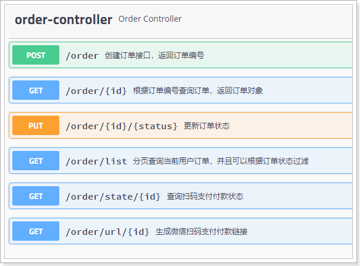

点击任意一个接口，即可看到详细信息：

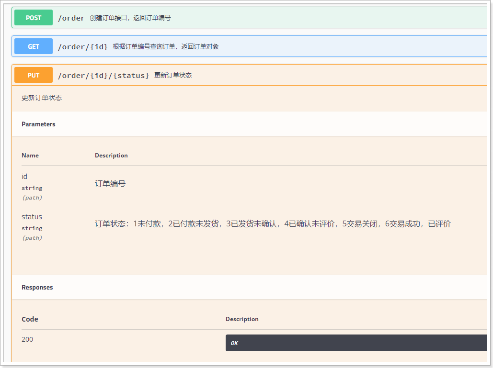


## 1.3.测试接口

### 1.3.1.创建订单接口

#### 数据准备：

可以通过页面看到接口信息：

- 请求方式：POST
- 请求路径：/order
- 请求参数：包含订单、订单详情等数据的json对象。
- 返回结果：订单编号

点击`Try It Out`来测试：


输入数据：

```json
{
  "totalPay": 236800,
  "postFee": 0,
  "paymentType": 2,
  "actualPay": 236800,
  "buyerMessage": null,
  "buyerNick": "huge",
  "orderDetails": [
    {
      "skuId": 3893493,
      "num": 1,
      "title": "苹果（Apple）iPhone 6 (A1586) 16GB 金色 移动联通电信4G手机3",
      "price": 236800,
      "ownSpec": "{\"机身颜色\":\"钻雕蓝\",\"内存\":\"4GB\",\"机身存储\":\"64GB\"}",
      "image": "http://image.leyou.com/images/9/4/1524297342728.jpg"
    }
  ],
  "receiver": "虎哥",
  "receiverMobile": "15800000000",
  "receiverState": "上海",
  "receiverCity": "上海",
  "receiverDistrict": "浦东新签",
  "receiverAddress": "航头镇航头路18号传智播客 3号楼",
  "receiverZip": "210000",
  "invoiceType": 0,
  "sourceType":2
}
```


#### 测试

然后点击execute：

 

结果：

 


#### 生成ID的方式

> 订单id的特殊性

订单数据非常庞大，将来一定会做分库分表。那么这种情况下， 要保证id的唯一，就不能靠数据库自增，而是自己来实现算法，生成唯一id。

> 雪花算法

这里的订单id是通过一个工具类生成的：

 

而工具类所采用的生成id算法，是由Twitter公司开源的snowflake（雪花）算法。

> 简单原理

雪花算法会生成一个64位的二进制数据，为一个Long型。(转换成字符串后长度最多19) ，其基本结构：

 

第一位：为未使用

第二部分：41位为毫秒级时间(41位的长度可以使用69年)

第三部分：5位datacenterId和5位workerId(10位的长度最多支持部署1024个节点）

第四部分：最后12位是毫秒内的计数（12位的计数顺序号支持每个节点每毫秒产生4096个ID序号）

snowflake生成的ID整体上按照时间自增排序，并且整个分布式系统内不会产生ID碰撞（由datacenter和workerId作区分），并且效率较高。经测试snowflake每秒能够产生26万个ID。

> 配置

为了保证不重复，我们给每个部署的节点都配置机器id：

```yaml
ly:
  worker:
    workerId: 1
    datacenterId: 1
```

加载属性：

```java
@ConfigurationProperties(prefix = "ly.worker")
public class IdWorkerProperties {

    private long workerId;// 当前机器id

    private long datacenterId;// 序列号

    public long getWorkerId() {
        return workerId;
    }

    public void setWorkerId(long workerId) {
        this.workerId = workerId;
    }

    public long getDatacenterId() {
        return datacenterId;
    }

    public void setDatacenterId(long datacenterId) {
        this.datacenterId = datacenterId;
    }
}
```

编写配置类：

```java
@Configuration
@EnableConfigurationProperties(IdWorkerProperties.class)
public class IdWorkerConfig {

    @Bean
    public IdWorker idWorker(IdWorkerProperties prop) {
        return new IdWorker(prop.getWorkerId(), prop.getDatacenterId());
    }
}
```

> 使用：

 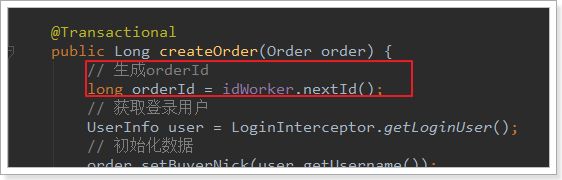

#### 完整代码

> controller

```java
@PostMapping
@ApiOperation(value = "创建订单接口，返回订单编号", notes = "创建订单")
@ApiImplicitParam(name = "order", required = true, value = "订单的json对象,包含订单条目和物流信息")
public ResponseEntity<Long> createOrder(@RequestBody @Valid Order order) {
    Long id = this.orderService.createOrder(order);
    return new ResponseEntity<>(id, HttpStatus.CREATED);
}
```

> service

```java
@Transactional
public Long createOrder(Order order) {
    // 生成orderId
    long orderId = idWorker.nextId();
    // 获取登录用户
    UserInfo user = LoginInterceptor.getLoginUser();
    // 初始化数据
    order.setBuyerNick(user.getUsername());
    order.setBuyerRate(false);
    order.setCreateTime(new Date());
    order.setOrderId(orderId);
    order.setUserId(user.getId());
    // 保存数据
    this.orderMapper.insertSelective(order);

    // 保存订单状态
    OrderStatus orderStatus = new OrderStatus();
    orderStatus.setOrderId(orderId);
    orderStatus.setCreateTime(order.getCreateTime());
    orderStatus.setStatus(1);// 初始状态为未付款

    this.statusMapper.insertSelective(orderStatus);

    // 订单详情中添加orderId
    order.getOrderDetails().forEach(od -> od.setOrderId(orderId));
    // 保存订单详情,使用批量插入功能
    this.detailMapper.insertList(order.getOrderDetails());

    logger.debug("生成订单，订单编号：{}，用户id：{}", orderId, user.getId());

    return orderId;
}
```


### 1.3.2.查询订单接口

#### 接口说明：

- 请求方式：GET
- 请求路径：/order/{id}
- 请求参数：id，订单编号
- 返回结果：Order，订单的json对象

#### 测试：

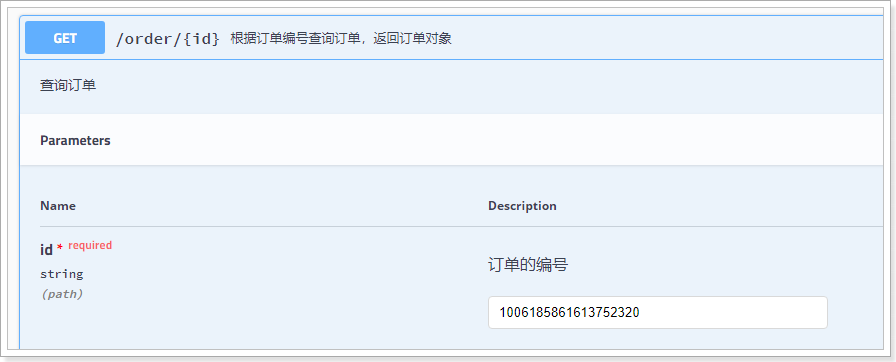

结果：

 

#### 代码：

> controller

```java
@GetMapping("{id}")
@ApiOperation(value = "根据订单编号查询订单，返回订单对象", notes = "查询订单")
@ApiImplicitParam(name = "id", required = true, value = "订单的编号")
public ResponseEntity<Order> queryOrderById(@PathVariable("id") Long id) {
    Order order = this.orderService.queryById(id);
    if (order == null) {
        return new ResponseEntity<>(HttpStatus.NOT_FOUND);
    }
    return ResponseEntity.ok(order);
}
```

> service

```java
public Order queryById(Long id) {
    // 查询订单
    Order order = this.orderMapper.selectByPrimaryKey(id);

    // 查询订单详情
    OrderDetail detail = new OrderDetail();
    detail.setOrderId(id);
    List<OrderDetail> details = this.detailMapper.select(detail);
    order.setOrderDetails(details);

    // 查询订单状态
    OrderStatus status = this.statusMapper.selectByPrimaryKey(order.getOrderId());
    order.setStatus(status.getStatus());
    return order;
}
```

### 1.3.3.更新订单状态

#### 接口说明

- 请求参数：PUT
- 请求路径：/order/{id}/{status}
- 请求参数：
  - id：订单编号，String类型，不能为空
  - status：订单状态，不能为空
- 返回结果：布尔类型
  - true：更新成功
  - false：更新失败

#### 测试：


结果：

 

数据库中也发生了改变：

 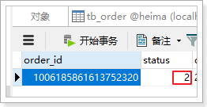

#### 代码：

> controller

```java
@PutMapping("{id}/{status}")
@ApiOperation(value = "更新订单状态", notes = "更新订单状态")
@ApiImplicitParams({
    @ApiImplicitParam(name = "id", value = "订单编号", type = "Long"),
    @ApiImplicitParam(
        name = "status", 
        value = "订单状态：1未付款，2已付款未发货，3已发货未确认，4已确认未评价，5交易关闭，6交易成功，已评价", 
        type = "Integer"),
})
@ApiResponses({
    @ApiResponse(code = 204, message = "true：修改状态成功；false：修改状态失败"),
    @ApiResponse(code = 400, message = "请求参数有误"),
    @ApiResponse(code = 500, message = "查询失败")
})
public ResponseEntity<Boolean> updateStatus(
    @PathVariable("id") Long id, @PathVariable("status") Integer status) {
    Boolean boo = this.orderService.updateStatus(id, status);
    if (boo == null) {
        // 返回400
        return new ResponseEntity<>(HttpStatus.BAD_REQUEST);
    }
    // 返回204
    return new ResponseEntity<>(HttpStatus.NO_CONTENT);
}
```

> service

```java
@Transactional
public Boolean updateStatus(Long id, Integer status) {
    OrderStatus record = new OrderStatus();
    record.setOrderId(id);
    record.setStatus(status);
    // 根据状态判断要修改的时间
    switch (status) {
        case 2:
            record.setPaymentTime(new Date());// 付款
            break;
        case 3:
            record.setConsignTime(new Date());// 发货
            break;
        case 4:
            record.setEndTime(new Date());// 确认收获，订单结束
            break;
        case 5:
            record.setCloseTime(new Date());// 交易失败，订单关闭
            break;
        case 6:
            record.setCommentTime(new Date());// 评价时间
            break;
        default:
            return null;
    }
    int count = this.statusMapper.updateByPrimaryKeySelective(record);
    return count == 1;
}
```


### 1.3.4.分页查询订单

#### 接口说明

- 请求方式：Get
- 请求路径：/order/list
- 请求参数：
  - page：当前页，Integer类型，默认为1
  - rows：每页大小，Integer类型，默认为5
  - status：订单状态，String类型，默认查询全部状态订单
- 返回结果：PageResult   对象，包含下面属性：
  - total：总条数
  - items：当前页订单数组
    - 订单对象

#### 测试：

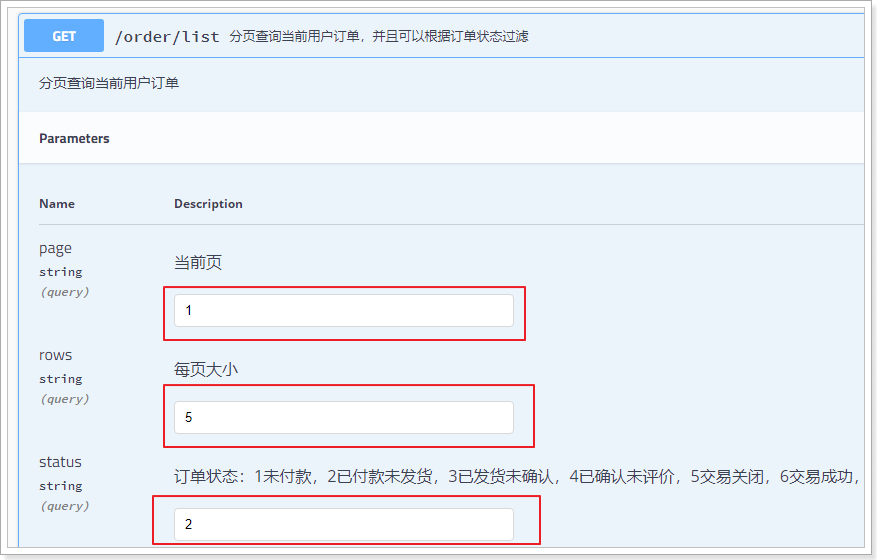

结果：

 

#### 代码：

> controller

```java
@GetMapping("list")
@ApiOperation(value = "分页查询当前用户订单，并且可以根据订单状态过滤", notes = "分页查询当前用户订单")
@ApiImplicitParams({
    @ApiImplicitParam(name = "page", value = "当前页", defaultValue = "1", type = "Integer"),
    @ApiImplicitParam(name = "rows", value = "每页大小", defaultValue = "5", type = "Integer"),
    @ApiImplicitParam(name = "status", value = "订单状态：1未付款，2已付款未发货，3已发货未确认，4已确认未评价，5交易关闭，6交易成功，已评价", type = "Integer"),
})
@ApiResponses({
    @ApiResponse(code = 200, message = "订单的分页结果"),
    @ApiResponse(code = 404, message = "没有查询到结果"),
    @ApiResponse(code = 500, message = "查询失败"),
})
public ResponseEntity<PageResult<Order>> queryUserOrderList(
    @RequestParam(value = "page", defaultValue = "1") Integer page,
    @RequestParam(value = "rows", defaultValue = "5") Integer rows,
    @RequestParam(value = "status", required = false) Integer status) {
    PageResult<Order> result = this.orderService.queryUserOrderList(page, rows, status);
    if (result == null) {
        return new ResponseEntity<>(HttpStatus.NOT_FOUND);
    }
    return ResponseEntity.ok(result);
}
```

> service

```java
public PageResult<Order> queryUserOrderList(Integer page, Integer rows, Integer status) {
    try {
        // 分页
        PageHelper.startPage(page, rows);
        // 获取登录用户
        UserInfo user = LoginInterceptor.getLoginUser();
        // 创建查询条件
        Page<Order> pageInfo = (Page<Order>) this.orderMapper.queryOrderList(user.getId(), status);

        return new PageResult<>(pageInfo.getTotal(), pageInfo);
    } catch (Exception e) {
        logger.error("查询订单出错", e);
        return null;
    }
}
```

需要注意，这里并不是使用通用mapper，而是自己编写Sql：

> mapper

```java
@Mapper
public interface OrderMapper extends tk.mybatis.mapper.common.Mapper<Order> {

    List<Order> queryOrderList(
        @Param("userId") Long userId, 
        @Param("status") Integer status);
}
```

> sql

```xml
<?xml version="1.0" encoding="UTF-8"?>
<!DOCTYPE mapper PUBLIC "-//mybatis.org//DTD Mapper 3.0//EN"
    "http://mybatis.org/dtd/mybatis-3-mapper.dtd">
<mapper namespace="com.leyou.order.mapper.OrderMapper">

    <resultMap id="orderWithDetail" type="com.leyou.order.pojo.Order" autoMapping="true">
        <id column="order_id" property="orderId" />
        <collection property="orderDetails" javaType="List" ofType="com.leyou.order.pojo.OrderDetail" autoMapping="true">
            <id property="id" column="id" />
        </collection>
    </resultMap>

    <select id="queryOrderList" resultMap="orderWithDetail">
        SELECT o.order_id,o.actual_pay, o.total_pay,o.create_time, os.status, od.sku_id,
        od.title ,od.image, od.num , od.own_spec, od.price
        FROM tb_order o
        LEFT JOIN tb_order_status os ON os.order_id = o.order_id
        LEFT JOIN tb_order_detail od ON od.order_id = o.order_id
        WHERE o.user_id = #{userId}
        <if test="status != null and status != 0">
            AND os.status = #{status}
        </if>
        ORDER BY o.create_time DESC
    </select>
</mapper>
```


### 1.3.5.生成微信付款链接

#### 接口说明：

- 请求方式：Get
- 请求路径：/order/url/{id}
- 请求参数：id，订单编号
- 返回结果：String类型，生成的微信支付链接


#### 测试：


结果：

 

#### 代码：

> controller

```java
@GetMapping("url/{id}")
@ApiOperation(value = "生成微信扫码支付付款链接", notes = "生成付款链接")
@ApiImplicitParam(name = "id", value = "订单编号", type = "Long")
@ApiResponses({
    @ApiResponse(code = 200, message = "根据订单编号生成的微信支付地址"),
    @ApiResponse(code = 404, message = "生成链接失败"),
    @ApiResponse(code = 500, message = "服务器异常"),
})
public ResponseEntity<String> generateUrl(@PathVariable("id") Long orderId) {
    // 生成付款链接
    String url = this.payHelper.createPayUrl(orderId);
    if (StringUtils.isBlank(url)) {
        return new ResponseEntity<>(HttpStatus.NOT_FOUND);
    }
    return ResponseEntity.ok(url);
}
```

可以看到这里直接调用了`payHelper`的方法。这是我们自己定义的微信支付工具。

#### 微信支付工具

> PayHelper

```java
@Component
public class PayHelper {

    private WXPay wxPay;

    private static final Logger logger = LoggerFactory.getLogger(PayHelper.class);

    @Autowired
    private StringRedisTemplate redisTemplate;

    @Autowired
    private OrderService orderService;

    public PayHelper(PayConfig payConfig) {
        // 真实开发时
        wxPay = new WXPay(payConfig);
        // 测试时
        // wxPay = new WXPay(payConfig, WXPayConstants.SignType.MD5, true);
    }

    public String createPayUrl(Long orderId) {
        String key = "ly.pay.url." + orderId;
        try {
            String url = this.redisTemplate.opsForValue().get(key);
            if (StringUtils.isNotBlank(url)) {
                return url;
            }
        } catch (Exception e) {
            logger.error("查询缓存付款链接异常,订单编号：{}", orderId, e);
        }

        try {
            Map<String, String> data = new HashMap<>();
            // 商品描述
            data.put("body", "乐优商城测试");
            // 订单号
            data.put("out_trade_no", orderId.toString());
            //货币
            data.put("fee_type", "CNY");
            //金额，单位是分
            data.put("total_fee", "1");
            //调用微信支付的终端IP（estore商城的IP）
            data.put("spbill_create_ip", "127.0.0.1");
            //回调地址
            data.put("notify_url", "http://test.leyou.com/wxpay/notify");
            // 交易类型为扫码支付
            data.put("trade_type", "NATIVE");
            //商品id,使用假数据
            data.put("product_id", "1234567");

            Map<String, String> result = this.wxPay.unifiedOrder(data);

            if ("SUCCESS".equals(result.get("return_code"))) {
                String url = result.get("code_url");
                // 将付款地址缓存，时间为10分钟
                try {
                    this.redisTemplate.opsForValue().set(key, url, 10, TimeUnit.MINUTES);
                } catch (Exception e) {
                    logger.error("缓存付款链接异常,订单编号：{}", orderId, e);
                }
                return url;
            } else {
                logger.error("创建预交易订单失败，错误信息：{}", result.get("return_msg"));
                return null;
            }
        } catch (Exception e) {
            logger.error("创建预交易订单异常", e);
            return null;
        }
    }

    /**
     * 查询订单状态
     *
     * @param orderId
     * @return
     */
    public PayState queryOrder(Long orderId) {
        Map<String, String> data = new HashMap<>();
        // 订单号
        data.put("out_trade_no", orderId.toString());
        try {
            Map<String, String> result = this.wxPay.orderQuery(data);
            if (result == null) {
                // 未查询到结果，认为是未付款
                return PayState.NOT_PAY;
            }
            String state = result.get("trade_state");
            if ("SUCCESS".equals(state)) {
                // success，则认为付款成功

                // 修改订单状态
                this.orderService.updateStatus(orderId, 2);
                return PayState.SUCCESS;
            } else if (StringUtils.equals("USERPAYING", state)
                       || StringUtils.equals("NOTPAY", state)) {
                // 未付款或正在付款，都认为是未付款
                return PayState.NOT_PAY;
            } else {
                // 其它状态认为是付款失败
                return PayState.FAIL;
            }
        } catch (Exception e) {
            logger.error("查询订单状态异常", e);
            return PayState.NOT_PAY;
        }
    }
}
```

跟支付相关的其它几个类：

 


### 1.3.6.查询支付状态

#### 接口说明

通过文档可以看出接口相关信息：

- 请求方式： Get
- 请求路径： /state/{id}
- 请求参数： id，订单编号
- 返回结果：0, 未查询到支付信息 1,支付成功 2,支付失败

#### 代码

> controller

```java
@GetMapping("state/{id}")
@ApiOperation(value = "查询扫码支付付款状态", notes = "查询付款状态")
@ApiImplicitParam(name = "id", value = "订单编号", type = "Long")
@ApiResponses({
            @ApiResponse(code = 200, message = "0, 未查询到支付信息 1,支付成功 2,支付失败"),
            @ApiResponse(code = 500, message = "服务器异常"),
    })
public ResponseEntity<Integer> queryPayState(@PathVariable("id") Long orderId) {
    PayState payState = this.payHelper.queryOrder(orderId);
    return ResponseEntity.ok(payState.getValue());
}
```


#### 未付款时查询

测试：

 

结果：

 

因为尚未付款，所以查询返回0，代表查询失败。


#### 付款

通过JS把链接变成二维码。

找到课前资料提供的JS页面：

 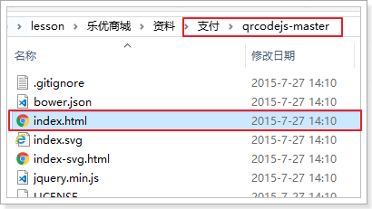

进入，并输入刚刚生成的地址：

 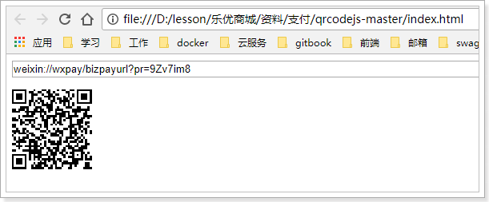

#### 付款后查询

扫码支付，然后再次查询：

 

状态码为1，代表支付成功了！


# 2.订单结算页

## 2.1.页面跳转

在购物车页面的最下方，有一个去结算按钮：


当点击结算，我们应该跳转到订单结算页，即：`getOrderInfo.html`

 

查看购物车的`结算`按钮：

 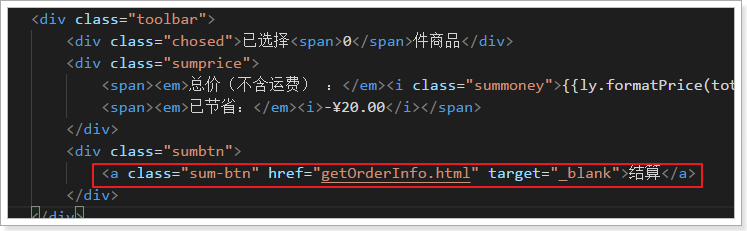

可以看到，地址是正确的。但是只有登录用户才可以去结算付款，因此我们不能直接跳转，而是在跳转前校验用户的登录状态，如果发现是未登录，应该重定向到登录页！

我们给这个按钮绑定点击事件：


事件中判断登录状态，进行页面跳转：

```js
toOrderInfo() {
    // 判断是否登录
    ly.http.get("/auth/verify")
        .then(() => {
        // 已登录
        window.location.href = "/getOrderInfo.html"
    }).catch(() => {
        // 未登录
        window.location.href = "/login.html?returnUrl=" + window.location.href;
    })
}
```


登录后测试：


此处页面需要渲染的内容主要包含3部分：

- 收货人信息
- 支付方式
- 商品信息


## 2.2.收货人信息（作业）


这里的收货人信息肯定是当前登录用户的收货地址。所以需要根据当前登录用户去查询，目前我们在页面是写的假数据：

 

大家可以在在后台提供地址的增删改查接口，然后页面加载时根据当前登录用户查询，而后赋值给addresses即可。

## 2.3.支付方式

支付方式有2种：

- 微信支付
- 货到付款

与我们订单数据中的`paymentType`关联：


所以我们可以在Vue实例中定义一个属性来记录支付方式：

 

然后在页面渲染时与这个变量关联：

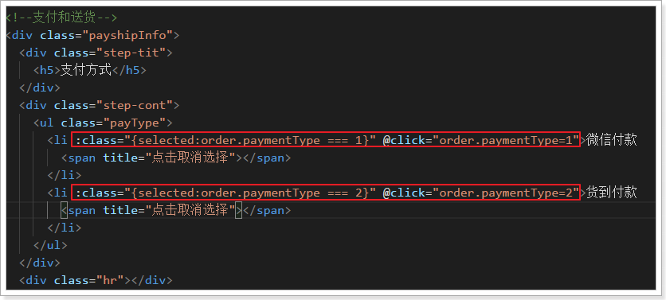

效果：

 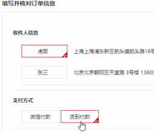

## 2.4.商品列表

效果图：


这里的送货清单，其实就是购物车中用户选择的要付款的商品

因此，我们需要在购物车跳转过来的同时，携带选中的购物车的信息

### 2.4.1.购物车信息获取

我们修改`cart.html`中的页面跳转逻辑，把用户选中的购物车信息传递过来：

 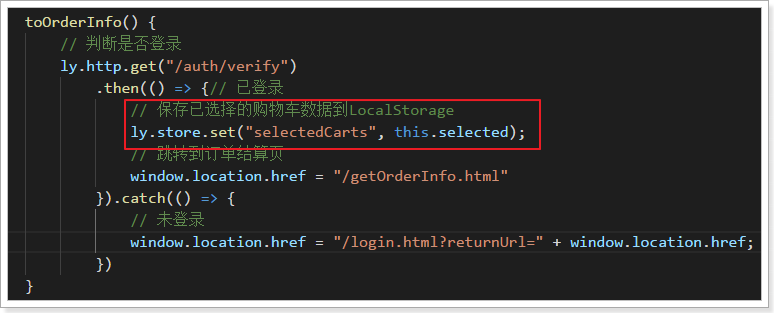

然后在`created`钩子函数中获取购物车数据，保存到本地属性，要注意的是，我们应该在获取数据前校验用户登录状态，如果发现未登录，则直接重定向到登录页：

 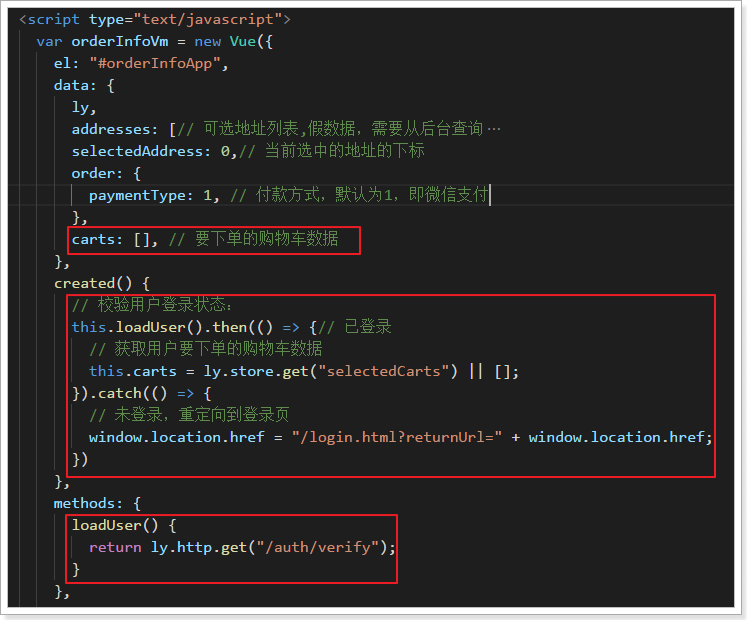

 

然后重新加载页面，查看控制台：


### 2.4.2.页面渲染

要修改的页面位置：

 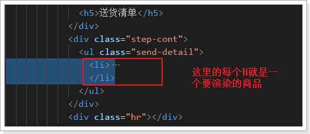

我们修改为：

```html
<div class="sendGoods">
    <ul class="yui3-g">
        <li class="yui3-u-1-6">
            <span>
                
            </span>
        </li>
        <li class="yui3-u-7-12">
            <div class="desc">{{c.title}}</div>
            <div class="seven" >
                <span v-for="(v,k) in JSON.parse(c.ownSpec)">{{k + ':' + v}} </span>
            </div>
        </li>
        <li class="yui3-u-1-12">
            <div class="price">￥{{ly.formatPrice(c.price * c.num)}}</div>
        </li>
        <li class="yui3-u-1-12">
            <div class="num">X{{c.num}}</div>
        </li>
        <li class="yui3-u-1-12">
            <div class="exit">有货</div>
        </li>
    </ul>
</div>
```

## 2.5.总金额

另外在商品列表下面，还有一个总金额的计算：

 

可以看出这里主要有4个数据：

- 总金额：totalPay
- 优惠返现：discount
- 运费：postFee
- 实付金额：actualPay

不过我们没有做优惠活动，另外运费需要结合物流系统来计算，暂时我们都设置为0，在order属性中写死：

 

我们通过计算属性来得到`totalPay`和`actualPay`值：

```js
computed: {
    totalPay() {// 总金额
        return this.carts.map(c => c.num * c.price).reduce((p1, p2) => p1 + p2, 0);
    },
    actualPay(){// 实际付款
        return this.totalPay - this.order.postFee - this.order.discount;
    }
}
```

然后在页面渲染：

 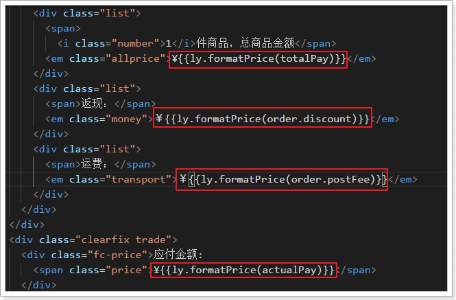

效果：

 


## 2.6.提交订单

### 2.6.1.页面提交

来看下订单接口所需要的数据：

 

分为3部分，分别是

- 订单本身的基本信息

  - 总金额
  - 实付金额
  - 付款类型
  - 买家信息就是当前用户

- 订单详情

  - 就是购物车中的商品，不过购物车数据会多出一个userId，我们去除即可：

      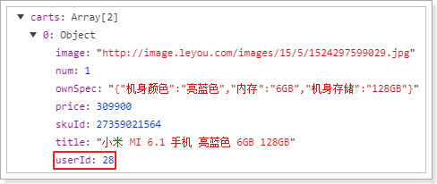

- 物流信息

  - 当前用户选中的物流地址信息


给提交按钮绑定事件：


然后编写方法，组织数据并提交：

```js
submit() {
    // 把购物车数据处理成订单详情
    const orderDetails = this.carts.map(({ userId, ...rest }) => rest);
    // 处理物流信息
    const addr = this.addresses[this.selectedAddress];
    const obj = {
        receiver: addr.name,
        receiverState: addr.state,
        receiverCity: addr.city,
        receiverAddress: addr.address,
        receiverDistrict: addr.district,
        receiverMobile: addr.phone,
        receiverZip: addr.zipCode
    };
    // 复制到订单对象
    Object.assign(this.order, obj, {
        orderDetails,
        totalPay: this.totalPay,
        actualPay: this.actualPay,
    });
    // 提交订单
    ly.http.post("/order", this.order)
        .then(({ data }) => {
            // 在线支付，需要到付款页
            window.location = "pay.html?orderId=" + data;
        })
        .catch((resp) => {
            alert("订单提交失败，可能是缺货!")
        })
}
```

### 2.6.2.精度损失问题

在页面点击提交测试：

 

成功生成订单！

然后看页面跳转：

 

好像有什么不对？订单号的最后2位不正确啊！

这其实是因为JS的长整数精度有限，java的Long类型数据超出了范围，所以出现了精度损失。

我们后台返回的是Json的字符串，在axios内部会自动调用 JSON.parse()方法把json字符串转为JS数据，就会出现进度损失。如果不进行转换，依然当做字符串来使用，就不会有问题了。

因此，我们重写axios对响应的处理回调函数：

 

再次测试，就OK了。

接下来就轮到支付了。


# 3.微信支付

## 3.1.介绍

微信支付官方文档：https://pay.weixin.qq.com/index.php/core/home/login?return_url=%2F


我们选择开发文档，而后进入选择页面：


选择扫码支付：


此处我们使用模式二来开发：

## 3.2.开发流程

模式二与模式一相比，流程更为简单，不依赖设置的回调支付URL。

商户后台系统先调用微信支付的统一下单接口，微信后台系统返回链接参数code_url；

商户后台系统将code_url值生成二维码图片，用户使用微信客户端扫码后发起支付。

注意：code_url有效期为2小时，过期后扫码不能再发起支付。 

流程图：


这里我们把商户（我们）要做的事情总结一下：

- 1、商户生成订单
- 2、商户调用微信下单接口，获取预交易的链接
- 3、商户将链接生成二维码图片，展示给用户；
- 4、用户支付并确认
- 5、支付结果通知：
  - 微信异步通知商户支付结果，商户告知微信支付接收情况
  - 商户如果没有收到通知，可以调用接口，查询支付状态
- 6、如果支付成功，发货，修改订单状态


在前面的业务中，我们已经完成了：

- 1、生成订单

接下来，我们需要做的是：

- 2、调用微信接口，生成链接。
- 3、并且生成二维码图片

## 3.3.生成二维码

### 3.3.1.生成预交易链接

我们先根据订单的编号，调用后台服务，生成交易链接，而后才能根据链接生成二维码。

在页面发起请求：

```js
var payVm = new Vue({
    el:"#payVm",
    data:{
        ly,
        orderId:0,// 订单编号
    },
    created(){
        // 判断登录状态
        ly.http.get("/auth/verify").then(() => {
            // 获取订单编号
            this.orderId = ly.getUrlParam("orderId");
            // 获取请求链接
            ly.http.get("/order/url/" + this.orderId)
                .then(resp => {
                    console.log(resp.data);
                })
        }.catch(() => {
			// 未登录，跳转至登录页
             location.href = "/login.html?returnUrl=" + location.href;
        })
    },
    components: {
        shortcut: () => import("./js/pages/shortcut.js")
    }
});
```

后台已经定义好生成付款地址的接口。

 

刷新页面查看：

 


### 3.3.2.生成二维码

这里我们使用一个生成二维码的JS插件：qrcode，官网：https://github.com/davidshimjs/qrcodejs

我们把课这个js脚本引入到项目中：

 

然后在页面引用：

 


页面定义一个div，用于展示二维码：

 

然后获取到付款链接后，根据链接生成二维码：

 

```js
// 判断登录状态
ly.http.get("/auth/verify").then(() => {
    // 获取订单编号
    this.orderId = ly.getUrlParam("orderId");
    // 获取请求链接
    ly.http.get("/order/url/" + this.orderId)
        .then(resp => {
            new QRCode(document.getElementById("qrImage"), {
                text: resp.data,
                width: 250,
                height: 250,
                colorDark: "#000000",
                colorLight: "#ffffff",
                correctLevel: QRCode.CorrectLevel.H
            });
        })
}).catch(() => {
    // 未登录，跳转至登录页
    location.href = "/login.html?returnUrl=" + location.href;
})
```


刷新页面，查看效果：

 

此时，客户用手机扫描二维码，可以看到付款页面。

## 3.4.付款状态查询

跳转到支付页面后，我们等待用户付款，付款完成则跳转到付款成功页面。

### 3.4.1.页面循环查询支付状态

不过，因为不清楚用户何时会付款，因此这里采用循环的方式，不断请求判断是否支付成功。

```js
// 开启定时任务，查询付款状态
const taskId = setInterval(() => {
    ly.http.get("/order/state/" + this.orderId)
        .then(resp => {
        let i = resp.data;
        if (i === 1) {
            // 付款成功
            clearInterval(taskId);
            // 跳转到付款成功页
            location.href = "/paysuccess.html?orderId=" + this.orderId;
        } else if (i === 2) {
            // 付款失败
            clearInterval(taskId);
            // 跳转到付款失败页
            location.href = "/payfail.html";
        }
    })
}, 3000);
```

### 3.4.2.付款成功页面

当付款成功后，自动跳转到付款成功页面：


