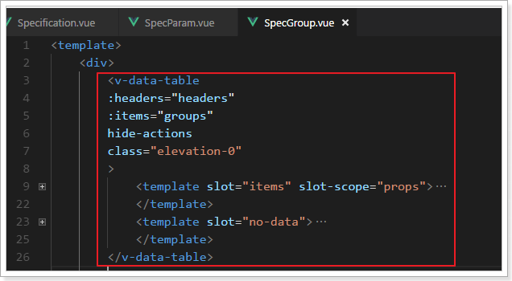
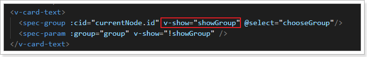
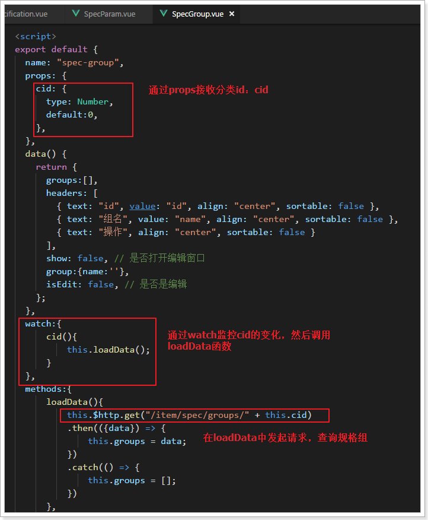
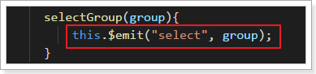
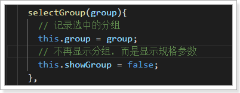
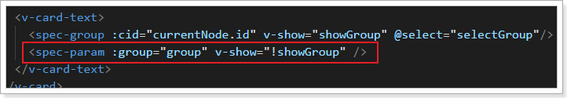
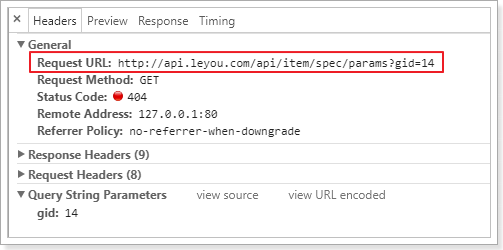
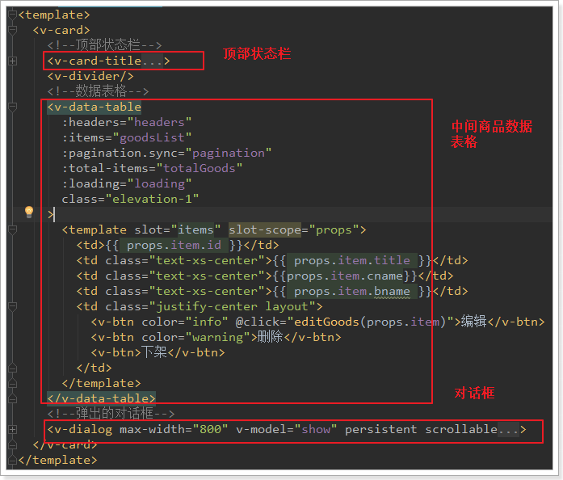
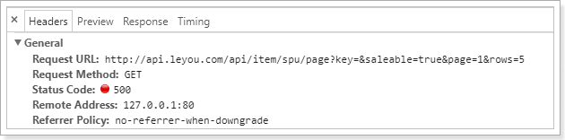

# 0.学习目标

- 了解商品规格数据结构设计思路
- 实现商品规格查询
- 了解SPU和SKU数据结构设计思路
- 实现商品查询


# 1.商品规格数据结构

乐优商城是一个全品类的电商网站，因此商品的种类繁多，每一件商品，其属性又有差别。为了更准确描述商品及细分差别，抽象出两个概念：SPU和SKU，了解一下：

## 1.1.SPU和SKU

SPU：Standard Product Unit （标准产品单位） ，一组具有共同属性的商品集

SKU：Stock Keeping Unit（库存量单位），SPU商品集因具体特性不同而细分的每个商品

以图为例来看：


- 本页的 华为Mate10 就是一个商品集（SPU）
- 因为颜色、内存等不同，而细分出不同的Mate10，如亮黑色128G版。（SKU）

可以看出：

- SPU是一个抽象的商品集概念，为了方便后台的管理。
- SKU才是具体要销售的商品，每一个SKU的价格、库存可能会不一样，用户购买的是SKU而不是SPU


## 1.2.数据库设计分析

### 1.2.1.思考并发现问题

弄清楚了SPU和SKU的概念区分，接下来我们一起思考一下该如何设计数据库表。

首先来看SPU，大家一起思考下SPU应该有哪些字段来描述？

```
id:主键
title：标题
description：描述
specification：规格
packaging_list：包装
after_service：售后服务
comment：评价
category_id：商品分类
brand_id：品牌
```

似乎并不复杂，但是大家仔细思考一下，商品的规格字段你如何填写？

 

不同商品的规格不一定相同，数据库中要如何保存？


再看下SKU，大家觉得应该有什么字段？

```
id：主键
spu_id：关联的spu
price：价格
images：图片
stock：库存
颜色？
内存？
硬盘？
```

碰到难题了，不同的商品分类，可能属性是不一样的，比如手机有内存，衣服有尺码，我们是全品类的电商网站，这些不同的商品的不同属性，如何设计到一张表中？


### 1.2.2.分析规格参数

仔细查看每一种商品的规格你会发现：

虽然商品规格千变万化，但是同一类商品（如手机）的规格是统一的，有图为证：

> 华为的规格：

 


> 三星的规格：

 


也就是说，商品的规格参数应该是与分类绑定的。**每一个分类都有统一的规格参数模板，但不同商品其参数值可能不同**。

如下图所示：

 

### 1.2.3.SKU的特有属性

SPU中会有一些特殊属性，用来区分不同的SKU，我们称为SKU特有属性。如华为META10的颜色、内存属性。

不同种类的商品，一个手机，一个衣服，其SKU属性不相同。

同一种类的商品，比如都是衣服，SKU属性基本是一样的，都是颜色、尺码等。

这样说起来，似乎SKU的特有属性也是与分类相关的？事实上，仔细观察你会发现，**SKU的特有属性是商品规格参数的一部分**：


也就是说，我们没必要单独对SKU的特有属性进行设计，它可以看做是规格参数中的一部分。这样规格参数中的属性可以标记成两部分：

- 所有sku共享的规格属性（称为全局属性）
- 每个sku不同的规格属性（称为特有属性）


### 1.2.4.搜索属性

打开一个搜索页，我们来看看过滤的条件：


你会发现，过滤条件中的屏幕尺寸、运行内存、网路、机身内存、电池容量、CPU核数等，在规格参数中都能找到：

 

也就是说，规格参数中的数据，将来会有一部分作为搜索条件来使用。我们可以在设计时，将这部分属性标记出来，将来做搜索的时候，作为过滤条件。要注意的是，无论是SPU的全局属性，还是SKU的特有属性，都有可能作为搜索过滤条件的，并不冲突，而是有一个交集：

 


## 1.3.规格参数表

### 1.3.1.整体数据结构

我们观察页面的规格参数结构：


可以看到规格参数是分组的，每一组都有多个参数键值对。不过对于规格参数的模板而言，其值现在是不确定的，不同的商品值肯定不同，模板中只要保存组信息、组内参数信息即可。

因此我们设计了两张表：

- tb_spec_group：组，与商品分类关联
- tb_spec_param：参数名，与组关联，一对多


### 1.3.2.规格组

规格参数分组表：tb_spec_group

```mysql
CREATE TABLE `tb_spec_group` (
  `id` bigint(20) NOT NULL AUTO_INCREMENT COMMENT '主键',
  `cid` bigint(20) NOT NULL COMMENT '商品分类id，一个分类下有多个规格组',
  `name` varchar(50) NOT NULL COMMENT '规格组的名称',
  PRIMARY KEY (`id`),
  KEY `key_category` (`cid`)
) ENGINE=InnoDB AUTO_INCREMENT=14 DEFAULT CHARSET=utf8 COMMENT='规格参数的分组表，每个商品分类下有多个规格参数组';
```

规格组有3个字段：

- id：主键
- cid：商品分类id，一个分类下有多个模板
- name：该规格组的名称。


### 1.3.2.规格参数

规格参数表：tb_spec_param

```mysql
CREATE TABLE `tb_spec_param` (
  `id` bigint(20) NOT NULL AUTO_INCREMENT COMMENT '主键',
  `cid` bigint(20) NOT NULL COMMENT '商品分类id',
  `group_id` bigint(20) NOT NULL,
  `name` varchar(255) NOT NULL COMMENT '参数名',
  `numeric` tinyint(1) NOT NULL COMMENT '是否是数字类型参数，true或false',
  `unit` varchar(255) DEFAULT '' COMMENT '数字类型参数的单位，非数字类型可以为空',
  `generic` tinyint(1) NOT NULL COMMENT '是否是sku通用属性，true或false',
  `searching` tinyint(1) NOT NULL COMMENT '是否用于搜索过滤，true或false',
  `segments` varchar(1000) DEFAULT '' COMMENT '数值类型参数，如果需要搜索，则添加分段间隔值，如CPU频率间隔：0.5-1.0',
  PRIMARY KEY (`id`),
  KEY `key_group` (`group_id`),
  KEY `key_category` (`cid`)
) ENGINE=InnoDB AUTO_INCREMENT=24 DEFAULT CHARSET=utf8 COMMENT='规格参数组下的参数名';
```

按道理来说，我们的规格参数就只需要记录参数名、组id、商品分类id即可。但是这里却多出了很多字段，为什么？

还记得我们之前的分析吧，规格参数中有一部分是 SKU的通用属性，一部分是SKU的特有属性，而且其中会有一些将来用作搜索过滤，这些信息都需要标记出来。

> 通用属性

用一个布尔类型字段来标记是否为通用：

- generic来标记是否为通用属性：
  - true：代表通用属性
  - false：代表sku特有属性

> 搜索过滤

与搜索相关的有两个字段：

- searching：标记是否用作过滤
  - true：用于过滤搜索
  - false：不用于过滤
- segments：某些数值类型的参数，在搜索时需要按区间划分，这里提前确定好划分区间
  - 比如电池容量，0~2000mAh，2000mAh~3000mAh，3000mAh~4000mAh

> 数值类型

某些规格参数可能为数值类型，这样的数据才需要划分区间，我们有两个字段来描述：

- numberic：是否为数值类型
  - true：数值类型
  - false：不是数值类型
- unit：参数的单位


# 2.商品规格参数管理

## 2.1.页面布局

### 2.1.1.整体布局

打开规格参数页面，看到如下内容：


商品分类树我们之前已经做过，所以这里可以直接展示出来。

因为规格是跟商品分类绑定的，因此首先会展现商品分类树，并且提示你要选择商品分类，才能看到规格参数的模板。一起了解下页面的实现：

 

页面结构：

 


这里使用了`v-layout`来完成页面布局，并且添加了row属性，代表接下来的内容是行布局（左右）。

可以看出页面分成2个部分：

- `<v-flex xs3>`：左侧，内部又分上下两部分：商品分类树及标题
  - `v-card-title`：标题部分，这里是提示信息，告诉用户要先选择分类，才能看到模板
  - `v-tree`：这里用到的是我们之前讲过的树组件，展示商品分类树，
- `<v-flex xs9 class="px-1">`：右侧：内部是规格参数展示


### 2.1.2.右侧规格

当我们点击一个分类时，最终要达到的效果：


可以看到右侧分为上下两部分：

- 上部：面包屑，显示当前选中的分类
- 下部：table，显示规格参数信息

页面实现：


可以看到右侧并不是我们熟悉的 `v-data-table`，而是一个`spec-group`组件和`spec-param`组件，这是我们定义的独立组件：

 

在SpecGroup中定义了表格：

 


## 2.2.规格组的查询

### 2.2.1.规格组和规格参数的切换

当我们点击规格参数组，表格中的数据会变为该组下的规格参数：


两者间的切换是如何实现的呢？

 

我们看到在`spec-group`和`spec-param`中，通过`v-show`来控制是否显示，对应的属性是：`showGroup`:

 

showGroup为true，则展示分组；为false，则展示组内参数。


### 2.2.2.树节点的点击事件

当我们点击树节点时，要将`v-dialog`打开，因此必须绑定一个点击事件：

 

我们来看下`handleClick`方法：

 

点击事件发生时，发生了两件事：

- 记录当前选中的节点，选中的就是商品分类
- `showGroup`被置为true，则规格组就会显示了。

同时，我们把被选中的节点（商品分类）的id传递给了`SpecGroup`组件：

 

### 2.2.3.页面查询规格组

来看下`SpecGroup.vue`中的实现：

 

我们查看页面控制台，可以看到请求已经发出：

 


### 2.2.4.后端代码

> 实体类

在`ly-item-interface`中添加实体类：

```java
@Table(name = "tb_spec_group")
public class SpecGroup {

    @Id
    @GeneratedValue(strategy = GenerationType.IDENTITY)
    private Long id;

    private Long cid;

    private String name;

   // getter和setter省略
}
```


在`ly-item-service`中编写业务：

> mapper

```java
public interface SpecGroupMapper extends Mapper<SpecGroup> {
}
```

> controller

先分析下需要的东西，在页面的ajax请求中可以看出：

- 请求方式：查询，肯定是get

- 请求路径：/spec/groups/{cid} ，这里通过路径占位符传递商品分类的id

- 请求参数：商品分类id

- 返回结果：页面是直接把`resp.data`赋值给了groups：

     

  那么我们返回的应该是规格组SpecGroup的集合

代码：

```java
@RestController
@RequestMapping("spec")
public class SpecificationController {

    @Autowired
    private SpecificationService specificationService;

    @GetMapping("groups/{cid}")
    public ResponseEntity<List<SpecGroup>> querySpecGroups(@PathVariable("cid") Long cid){
        List<SpecGroup> list = this.specificationService.querySpecGroups(cid);
        if(list == null || list.size() == 0){
            return new ResponseEntity<>(HttpStatus.NOT_FOUND);
        }
        return ResponseEntity.ok(list);
    }
}
```


> service:

```java
@Service
public class SpecificationService {

    @Autowired
    private SpecGroupMapper specGroupMapper;

    public List<SpecGroup> querySpecGroups(Long cid) {
        SpecGroup t = new SpecGroup();
        t.setCid(cid);
        return this.specGroupMapper.select(t);
    }
}
```


> 页面访问测试：

目前，我们数据库只为手机分类（76）提供了规格组：

  

我们访问：http://api.leyou.com/api/item/spec/groups/76

 

然后在后台系统中测试：


## 2.3.规格参数查询

### 2.3.1.表格切换

当我们点击规格组，会切换到规格参数显示，肯定是在规格组中绑定了点击事件：

 

我们看下事件处理：

 

可以看到这里是使用了 父子通信，子组件触发了select事件：


再来看下父组件的事件绑定：

 

事件处理：

 

这里我们记录了选中的分组，并且把标记设置为false，这样规格组就不显示了，而是显示：`SpecParam`

并且，我们把group也传递到`spec-param`组件：

 


### 2.3.2.页面查询规格参数

我们来看`SpecParam.vue`的实现：


查看页面控制台，发现请求已经发出：

 


### 2.3.3.后台实现

> 实体类：

```java
@Table(name = "tb_spec_param")
public class SpecParam {
    @Id
    @GeneratedValue(strategy = GenerationType.IDENTITY)
    private Long id;
    private Long cid;
    private Long groupId;
    private String name;
    @Column(name = "`numeric`")
    private Boolean numeric;
    private String unit;
    private Boolean generic;
    private Boolean searching;
    private String segments;
    
    // getter和setter ...
}
```

> controller

分析：

- 请求方式：GET
- 请求路径：/spec/params
- 请求参数：gid，分组id
- 返回结果：该分组下的规格参数集合`List<SpecParam>`

代码：

```java
@GetMapping("/params")
public ResponseEntity<List<SpecParam>> querySpecParam(
    @RequestParam(value="gid", required = false) Long gid
    ){
        List<SpecParam> list =
                this.specificationService.querySpecParams(gid);
        if(list == null || list.size() == 0){
            return new ResponseEntity<>(HttpStatus.NOT_FOUND);
        }
        return ResponseEntity.ok(list);
    }
```


> service

```java
public List<SpecParam> querySpecParams(Long gid){
    SpecParam t = new SpecParam();
    t.setGroupId(gid);
    return this.specParamMapper.select(t);
}
```

> mapper

```java
public interface SpecParamMapper extends Mapper<SpecParam> {
}
```

测试：

 

在页面刷新：


## 2.4.增、删、改（作业）

增删改的作业就留给大家去完成了。页面中接口都已定义，你要做的就是实现后台接口。


# 3.SPU和SKU数据结构

规格确定以后，就可以添加商品了,先看下数据库表

## 3.1.SPU表

### 3.1.1.表结构

SPU表：

```mysql
CREATE TABLE `tb_spu` (
  `id` bigint(20) NOT NULL AUTO_INCREMENT COMMENT 'spu id',
  `title` varchar(255) NOT NULL DEFAULT '' COMMENT '标题',
  `sub_title` varchar(255) DEFAULT '' COMMENT '子标题',
  `cid1` bigint(20) NOT NULL COMMENT '1级类目id',
  `cid2` bigint(20) NOT NULL COMMENT '2级类目id',
  `cid3` bigint(20) NOT NULL COMMENT '3级类目id',
  `brand_id` bigint(20) NOT NULL COMMENT '商品所属品牌id',
  `saleable` tinyint(1) NOT NULL DEFAULT '1' COMMENT '是否上架，0下架，1上架',
  `valid` tinyint(1) NOT NULL DEFAULT '1' COMMENT '是否有效，0已删除，1有效',
  `create_time` datetime DEFAULT NULL COMMENT '添加时间',
  `last_update_time` datetime DEFAULT NULL COMMENT '最后修改时间',
  PRIMARY KEY (`id`)
) ENGINE=InnoDB AUTO_INCREMENT=208 DEFAULT CHARSET=utf8 COMMENT='spu表，该表描述的是一个抽象的商品，比如 iphone8';
```

与我们前面分析的基本类似，但是似乎少了一些字段，比如商品描述。

我们做了表的垂直拆分，将SPU的详情放到了另一张表：tb_spu_detail

```mysql
CREATE TABLE `tb_spu_detail` (
  `spu_id` bigint(20) NOT NULL,
  `description` text COMMENT '商品描述信息',
  `generic_spec` varchar(3000) NOT NULL DEFAULT '' COMMENT '通用规格参数数据',
  `special_spec` varchar(1000) NOT NULL COMMENT '特有规格参数及可选值信息，json格式',
  `packing_list` varchar(1000) DEFAULT '' COMMENT '包装清单',
  `after_service` varchar(1000) DEFAULT '' COMMENT '售后服务',
  PRIMARY KEY (`spu_id`)
) ENGINE=InnoDB DEFAULT CHARSET=utf8;

```

这张表中的数据都比较大，为了不影响主表的查询效率我们拆分出这张表。

需要注意的是这两个字段：generic_spec和special_spec。

### 3.1.2.spu中的规格参数

前面讲过规格参数与商品分类绑定，一个分类下的所有SPU具有类似的规格参数。SPU下的SKU可能会有不同的规格参数，因此我们计划是这样：

- SPU中保存通用的规格参数信息。
- SKU中保存特有规格参数。

来看下我们的 表如何存储这些信息：

#### 3.1.2.1.generic_spec字段

首先是`generic_spec`，其中保存通用规格参数信息的值，这里为了方便查询，使用了json格式：

> 整体来看：

 

json结构，其中都是键值对：

- key：对应的规格参数的`spec_param`的id
- value：对应规格参数的值


#### 3.1.2.2.special_spec字段

我们说spu中只保存通用规格参数，那么为什么有多出了一个`special_spec`字段呢？


以手机为例，品牌、操作系统等肯定是全局通用属性，内存、颜色等肯定是特有属性。

当你确定了一个SPU，比如小米的：红米4X

全局属性值都是固定的了：

```
品牌：小米
型号：红米4X
```

特有属性举例：

```
颜色：[香槟金, 樱花粉, 磨砂黑]
内存：[2G, 3G]
机身存储：[16GB, 32GB]
```

颜色、内存、机身存储，作为Sku特有属性，key虽然一样，但是SPU下的每一个sku，其值都不一样，所以值会有很多，形成数组。

我们在SPU中，会把特有属性的所有值都记录下来，形成一个数组：


里面又有哪些内容呢？

来看数据格式：

 

也是json结构：

- key：规格参数id
- value：spu属性的数组


那么问题来：特有规格参数应该在sku中记录才对，为什么在spu中也要记录一份？


因为我们有时候需要把所有规格参数都查询出来，而不是只查询1个sku的属性。比如，商品详情页展示可选的规格参数时：

   

刚好符号我们的结构，这样页面渲染就非常方便了。


## 3.2.SKU表

### 3.2.1.表结构

```mysql
CREATE TABLE `tb_sku` (
  `id` bigint(20) NOT NULL AUTO_INCREMENT COMMENT 'sku id',
  `spu_id` bigint(20) NOT NULL COMMENT 'spu id',
  `title` varchar(255) NOT NULL COMMENT '商品标题',
  `images` varchar(1000) DEFAULT '' COMMENT '商品的图片，多个图片以‘,’分割',
  `price` bigint(15) NOT NULL DEFAULT '0' COMMENT '销售价格，单位为分',
  `indexes` varchar(100) COMMENT '特有规格属性在spu属性模板中的对应下标组合',
  `own_spec` varchar(1000) COMMENT 'sku的特有规格参数，json格式',
  `enable` tinyint(1) NOT NULL DEFAULT '1' COMMENT '是否有效，0无效，1有效',
  `create_time` datetime NOT NULL COMMENT '添加时间',
  `last_update_time` datetime NOT NULL COMMENT '最后修改时间',
  PRIMARY KEY (`id`),
  KEY `key_spu_id` (`spu_id`) USING BTREE
) ENGINE=InnoDB DEFAULT CHARSET=utf8 COMMENT='sku表,该表表示具体的商品实体,如黑色的64GB的iphone 8';
```

还有一张表，代表库存：

```mysql
CREATE TABLE `tb_stock` (
  `sku_id` bigint(20) NOT NULL COMMENT '库存对应的商品sku id',
  `seckill_stock` int(9) DEFAULT '0' COMMENT '可秒杀库存',
  `seckill_total` int(9) DEFAULT '0' COMMENT '秒杀总数量',
  `stock` int(9) NOT NULL COMMENT '库存数量',
  PRIMARY KEY (`sku_id`)
) ENGINE=InnoDB DEFAULT CHARSET=utf8 COMMENT='库存表，代表库存，秒杀库存等信息';
```

问题：为什么要将库存独立一张表？

因为库存字段写频率较高，而SKU的其它字段以读为主，因此我们将两张表分离，读写不会干扰。


特别需要注意的是sku表中的`indexes`字段和`own_spec`字段。sku中应该保存特有规格参数的值，就在这两个字段中。


### 3.2.2.sku中的特有规格参数

#### 3.2.2.1.indexes字段

在SPU表中，已经对特有规格参数及可选项进行了保存，结构如下：

```json
{
    "4": [
        "香槟金",
        "樱花粉",
        "磨砂黑"
    ],
    "12": [
        "2GB",
        "3GB"
    ],
    "13": [
        "16GB",
        "32GB"
    ]
}
```

这些特有属性如果排列组合，会产生12个不同的SKU，而不同的SKU，其属性就是上面备选项中的一个。

比如：

- 红米4X，香槟金，2GB内存，16GB存储
- 红米4X，磨砂黑，2GB内存，32GB存储

你会发现，每一个属性值，对应于SPUoptions数组的一个选项，如果我们记录下角标，就是这样：

- 红米4X，0,0,0
- 红米4X，2,0,1

既然如此，我们是不是可以将不同角标串联起来，作为SPU下不同SKU的标示。这就是我们的indexes字段。

 

这个设计在商品详情页会特别有用：

 

当用户点击选中一个特有属性，你就能根据 角标快速定位到sku。

#### 3.2.2.2.own_spec字段

看结构：

```json
{"4":"香槟金","12":"2GB","13":"16GB"}
```

保存的是特有属性的键值对。

SPU中保存的是可选项，但不确定具体的值，而SKU中的保存的就是具体的值。


## 3.3.导入图片信息

现在商品表中虽然有数据，但是所有的图片信息都是无法访问的，我们需要把图片导入到虚拟机：

首先，把课前资料提供的数据上传到虚拟机下：`/leyou/static`目录：


然后，使用命令解压缩：

```sh
unzip images.zip
```


修改Nginx配置，使nginx反向代理这些图片地址：

```sh
vim /opt/nginx/config/nginx.conf
```

修改成如下配置：

```nginx
server {
    listen       80;
    server_name  image.leyou.com;

    # 监听域名中带有group的，交给FastDFS模块处理
    location ~/group([0-9])/ {
        ngx_fastdfs_module;
    }
    # 将其它图片代理指向本地的/leyou/static目录
    location / {
        root   /leyou/static/;
    }

    error_page   500 502 503 504  /50x.html;
    location = /50x.html {
        root   html;
    }

}
```


# 4.商品查询

## 4.1.效果预览

接下来，我们实现商品管理的页面，先看下我们要实现的效果：


可以看出整体是一个table，然后有新增按钮。是不是跟昨天写品牌管理很像？

## 4.2.页面请求

先看整体页面结构：

 

并且在Vue实例挂载时就会发起查询：

 

我们刷新页面，可以看到浏览器发起已经发起了查询商品数据的请求：

 

因此接下来，我们编写接口即可。


## 4.3.后台提供接口

页面已经准备好，接下来在后台提供分页查询SPU的功能：

### 4.3.1.实体类

> SPU

```java
@Table(name = "tb_spu")
public class Spu {
    @Id
    @GeneratedValue(strategy = GenerationType.IDENTITY)
    private Long id;
    private Long brandId;
    private Long cid1;// 1级类目
    private Long cid2;// 2级类目
    private Long cid3;// 3级类目
    private String title;// 标题
    private String subTitle;// 子标题
    private Boolean saleable;// 是否上架
    private Boolean valid;// 是否有效，逻辑删除用
    private Date createTime;// 创建时间
    private Date lastUpdateTime;// 最后修改时间
	// 省略getter和setter
}
```


> SPU详情

```java
@Table(name="tb_spu_detail")
public class SpuDetail {
    @Id
    private Long spuId;// 对应的SPU的id
    private String description;// 商品描述
    private String specialSpec;// 商品特殊规格的名称及可选值模板
    private String genericSpec;// 商品的全局规格属性
    private String packingList;// 包装清单
    private String afterService;// 售后服务
    // 省略getter和setter
}
```

### 4.3.2.controller

先分析：

- 请求方式：GET

- 请求路径：/spu/page

- 请求参数：

  - page：当前页
  - rows：每页大小
  - key：过滤条件
  - saleable：上架或下架

- 返回结果：商品SPU的分页信息。

  - 要注意，页面展示的是商品分类和品牌名称，而数据库中保存的是id，怎么办？

    我们可以新建一个类，继承SPU，并且拓展cname和bname属性，写到`ly-item-interface`

    ```java
    public class SpuBo extends Spu {
    
        String cname;// 商品分类名称
        
        String bname;// 品牌名称
        
        // 略 。。
    }
    ```

编写controller代码：

我们把与商品相关的一切业务接口都放到一起，起名为GoodsController，业务层也是这样

```java
@RestController
public class GoodsController {

    @Autowired
    private GoodsService goodsService;

    @GetMapping("spu/page")
    public ResponseEntity<PageResult<SpuBo>> querySpuByPage(
            @RequestParam(value = "page", defaultValue = "1") Integer page,
            @RequestParam(value = "rows", defaultValue = "5") Integer rows,
            @RequestParam(value = "saleable", required = false) Boolean saleable,
            @RequestParam(value = "key", required = false) String key) {
        PageResult<SpuBo> result = this.goodsService.querySpuPage(page, rows, saleable, key);
        if (result == null) {
            return ResponseEntity.status(HttpStatus.NOT_FOUND).body(null);
        }
        return ResponseEntity.ok(result);
    }}
}
```


### 4.4.3.service

所有商品相关的业务（包括SPU和SKU）放到一个业务下：GoodsService。

```java
@Service
public class GoodsService {

    @Autowired
    private SpuMapper spuMapper;

    @Autowired
    private CategoryService categoryService;

    @Autowired
    private BrandMapper brandMapper;

    public PageResult<SpuBo> querySpuByPageAndSort(Integer page, Integer rows, Boolean saleable, String key) {
        // 1、查询SPU
        // 分页,最多允许查100条
        PageHelper.startPage(page, Math.min(rows, 200));

        // 创建查询条件
        Example example = new Example(Spu.class);
        Example.Criteria criteria = example.createCriteria();

        // 是否过滤上下架
        if (saleable != null) {
            criteria.orEqualTo("saleable", saleable);
        }
        
        // 是否模糊查询
        if (StringUtils.isNotBlank(key)) {
            criteria.andLike("title", "%" + key + "%");
        }
        Page<Spu> pageInfo = (Page<Spu>) this.spuMapper.selectByExample(example);

        List<SpuBo> list = pageInfo.getResult().stream().map(spu -> {
            // 把spu变为 spuBo
            SpuBo spuBo = new SpuBo();
            // 属性拷贝
            BeanUtils.copyProperties(spu, spuBo);

            // 2、查询spu的商品分类名称,要查三级分类
            List<String> names = this.categoryService.queryNameByIds(
                    Arrays.asList(spu.getCid1(), spu.getCid2(), spu.getCid3()));
            // 将分类名称拼接后存入
            spuBo.setCname(StringUtils.join(names, "/"));

            // 3、查询spu的品牌名称
            Brand brand = this.brandMapper.selectByPrimaryKey(spu.getBrandId());
            spuBo.setBname(brand.getName());
            return spuBo;
        }).collect(Collectors.toList());

        return new PageResult<>(pageInfo.getTotal(), list);
    }
}
```


### 4.4.4.mapper

```java
public interface SpuMapper extends Mapper<Spu> {
}
```


### 4.4.5.Category中拓展查询名称的功能

页面需要商品的分类名称需要在这里查询，因此要额外提供查询分类名称的功能，

在CategoryService中添加功能：

```java
public List<String> queryNamesByIds(List<Long> ids) {
    List<Category> list = this.categoryMapper.selectByIdList(ids);
    List<String> names = new ArrayList<>();
    for (Category category : list) {
        names.add(category.getName());
    }
    return names;
    // return list.stream().map(category -> category.getName()).collect(Collectors.toList());
}
```

mapper的selectByIDList方法是来自于通用mapper。不过需要我们在mapper上继承一个通用mapper接口：

```java
public interface CategoryMapper extends Mapper<Category>, SelectByIdListMapper<Category, Long> { 
    // ...coding
}
```

## 4.5.测试

刷新页面，查看效果：

 


基本与预览的效果一致，OK！


