# 0.学习目标


# 1.搭建购物车服务

## 1.1.创建module


## 1.2.pom依赖

```xml
<?xml version="1.0" encoding="UTF-8"?>
<project xmlns="http://maven.apache.org/POM/4.0.0"
         xmlns:xsi="http://www.w3.org/2001/XMLSchema-instance"
         xsi:schemaLocation="http://maven.apache.org/POM/4.0.0 http://maven.apache.org/xsd/maven-4.0.0.xsd">
    <parent>
        <artifactId>leyou</artifactId>
        <groupId>com.leyou.parent</groupId>
        <version>1.0.0-SNAPSHOT</version>
    </parent>
    <modelVersion>4.0.0</modelVersion>

    <groupId>com.leyou.service</groupId>
    <artifactId>ly-cart</artifactId>
    <version>1.0.0-SNAPSHOT</version>

    <dependencies>
        <dependency>
            <groupId>org.springframework.boot</groupId>
            <artifactId>spring-boot-starter-web</artifactId>
        </dependency>
        <dependency>
            <groupId>org.springframework.cloud</groupId>
            <artifactId>spring-cloud-starter-netflix-eureka-client</artifactId>
        </dependency>
        <dependency>
            <groupId>org.springframework.cloud</groupId>
            <artifactId>spring-cloud-starter-openfeign</artifactId>
        </dependency>
        <dependency>
            <groupId>org.springframework.boot</groupId>
            <artifactId>spring-boot-starter-data-redis</artifactId>
        </dependency>
    </dependencies>
</project>
```

## 1.3.配置文件

```yaml
server:
  port: 8088
spring:
  application:
    name: cart-service
  redis:
    host: 192.168.56.101
eureka:
  client:
    service-url:
      defaultZone: http://127.0.0.1:10086/eureka
    registry-fetch-interval-seconds: 5
  instance:
    prefer-ip-address: true
    ip-address: 127.0.0.1
    instance-id: ${eureka.instance.ip-address}.${server.port}
    lease-renewal-interval-in-seconds: 3
    lease-expiration-duration-in-seconds: 10
```

## 1.4.启动类

```java
@SpringBootApplication
@EnableDiscoveryClient
@EnableFeignClients
public class LyCartApplication {

    public static void main(String[] args) {
        SpringApplication.run(LyCartApplication.class, args);
    }
}
```


# 2.购物车功能分析

## 2.1.需求

需求描述：

- 用户可以在登录状态下将商品添加到购物车
  - 放入数据库
  - 放入redis（采用）
- 用户可以在未登录状态下将商品添加到购物车
  - 放入localstorage
- 用户可以使用购物车一起结算下单
- 用户可以查询自己的购物车
- 用户可以在购物车中可以修改购买商品的数量。
- 用户可以在购物车中删除商品。
- 在购物车中展示商品优惠信息
- 提示购物车商品价格变化


## 2.2.流程图：


这幅图主要描述了两个功能：新增商品到购物车、查询购物车。

新增商品：

- 判断是否登录
  - 是：则添加商品到后台Redis中
  - 否：则添加商品到本地的Localstorage

无论哪种新增，完成后都需要查询购物车列表：

- 判断是否登录
  - 否：直接查询localstorage中数据并展示
  - 是：已登录，则需要先看本地是否有数据，
    - 有：需要提交到后台添加到redis，合并数据，而后查询
    - 否：直接去后台查询redis，而后返回


# 3.未登录购物车

## 3.1.准备

### 3.1.1购物车的数据结构

首先分析一下未登录购物车的数据结构。

我们看下页面展示需要什么数据：


因此每一个购物车信息，都是一个对象，包含：

```js
{
    skuId:2131241,
    title:"小米6",
    image:"",
    price:190000,
    num:1,
    ownSpec:"{"机身颜色":"陶瓷黑尊享版","内存":"6GB","机身存储":"128GB"}"
}
```

另外，购物车中不止一条数据，因此最终会是对象的数组。即：

```js
[
    {...},{...},{...}
]
```


### 3.1.2.web本地存储

知道了数据结构，下一个问题，就是如何保存购物车数据。前面我们分析过，可以使用Localstorage来实现。Localstorage是web本地存储的一种，那么，什么是web本地存储呢？

#### 什么是web本地存储？


web本地存储主要有两种方式：

- LocalStorage：localStorage 方法存储的数据没有时间限制。第二天、第二周或下一年之后，数据依然可用。 
- SessionStorage：sessionStorage 方法针对一个 session 进行数据存储。当用户关闭浏览器窗口后，数据会被删除。 


#### LocalStorage的用法

语法非常简单：

 

```js
localStorage.setItem("key","value"); // 存储数据
localStorage.getItem("key"); // 获取数据
localStorage.removeItem("key"); // 删除数据
```

注意：**localStorage和SessionStorage都只能保存字符串**。

不过，在我们的common.js中，已经对localStorage进行了简单的封装：

 


示例：

 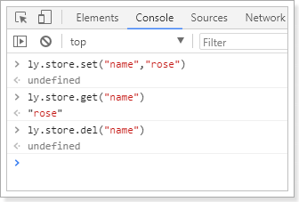


### 3.1.3.获取num

添加购物车需要知道购物的数量，所以我们需要获取数量大小。我们在Vue中定义num，保存数量：

 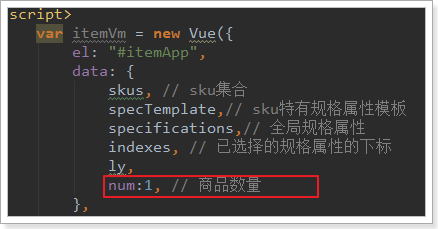

然后将num与页面的input框绑定，同时给`+`和`-`的按钮绑定事件：


编写事件：

 


## 3.2.添加购物车

### 3.2.1.点击事件

我们看下商品详情页：


现在点击加入购物车会跳转到购物车成功页面。

不过我们不这么做，我们绑定点击事件，然后实现添加购物车功能。

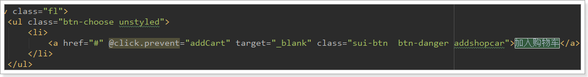

addCart方法中判断用户的登录状态：

 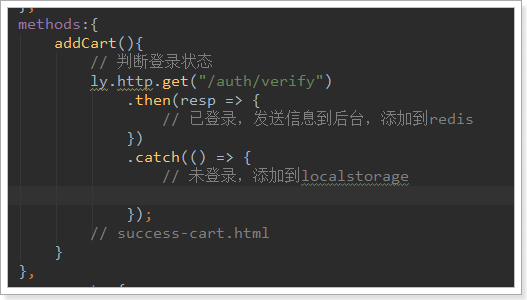


### 3.2.2.获取数量，添加购物车

```js
addCart(){
    // 判断登录状态
    ly.http.get("/auth/verify")
        .then(resp => {

    })
        .catch(() => {
        // 未登录，添加到localstorage
        // 1、查询本地购物车
        const carts = ly.store.get("carts") || [];
        let cart = carts.find(c => c.skuId === this.sku.id);
        // 2、判断是否存在
        if(cart){
            // 3、存在，改数量
            cart.num += this.num;
        }else {
            // 4、不存在，新增
            cart = {
                skuId: this.sku.id,
                title: this.sku.title,
                image: this.images[0],
                price: this.sku.price,
                num: this.num,
                ownSpec: JSON.stringify(this.ownSpec)
            };
            carts.push(cart);
        }
        // 把carts写回localstorage
        ly.store.set("carts", carts);

        // 跳转
        window.location.href = "http://www.leyou.com/cart.html";
    });
}
```

结果：

 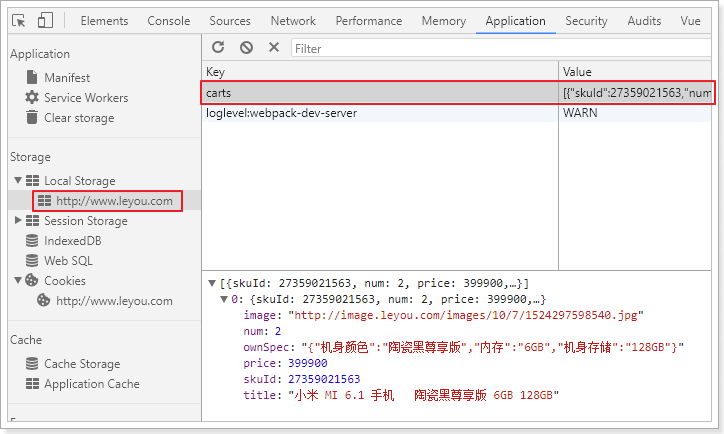

添加完成后，页面会跳转到购物车结算页面：cart.html


## 3.3.查询购物车

### 3.3.1.校验用户登录

因为会多次校验用户登录状态，因此我们封装一个校验的方法：

在common.js中：

 


### 3.3.2.查询购物车

页面加载时，就应该去查询购物车。

```java
var cartVm = new Vue({
    el: "#cartApp",
    data: {
        ly,
        carts: [],// 购物车数据
    },
    created() {
        this.loadCarts();
    },
    methods: {
        loadCarts() {
            // 先判断登录状态
            ly.verifyUser()
                .then(() => {
                    // 已登录

                })
                .catch(() => {
                    // 未登录
                    this.carts = ly.store.get("carts") || [];
                    this.selected = this.carts;
                })
                }
    }
    components: {
        shortcut: () => import("/js/pages/shortcut.js")
    }
})
```

刷新页面，查看控制台Vue实例：

 


### 3.5.2.渲染到页面

接下来，我们在页面中展示carts的数据：

页面位置：

 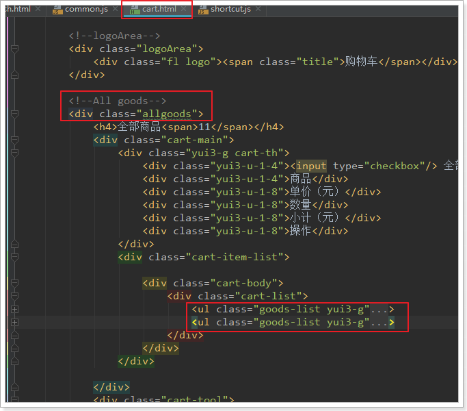


修改后：


要注意，价格的展示需要进行格式化，这里使用的是我们在common.js中定义的formatPrice方法：

 


效果：


## 3.6.修改数量

我们给页面的 `+` 和 `-`绑定点击事件，修改num 的值：


两个事件：

```js
increment(c) {
    c.num++;
    ly.verifyUser()
        .then(() => {
            // TODO 已登录，向后台发起请求
        })
        .catch(() => {
            // 未登录，直接操作本地数据
            ly.store.set("carts", this.carts);
    })
},
decrement(c) {
    if (c.num <= 1) {
        return;
    }
    c.num--;
    this.verifyUser()
        .then(() => {
        // TODO 已登录，向后台发起请求
        })
        .catch(() => {
            // 未登录，直接操作本地数据
            ly.store.set("carts", this.carts);
        })
},
```


## 3.7.删除商品

给删除按钮绑定事件：

 


点击事件中删除商品：

```js
deleteCart(i) {
    this.verifyUser()
        .then(() => {
            // 已登录
        })
        .catch(() => {
            // 未登录
            this.carts.splice(i, 1);
            ly.store.set("carts", this.carts);
        })
}
```


## 3.8.选中商品

在页面中，每个购物车商品左侧，都有一个复选框，用户可以选择部分商品进行下单，而不一定是全部：

 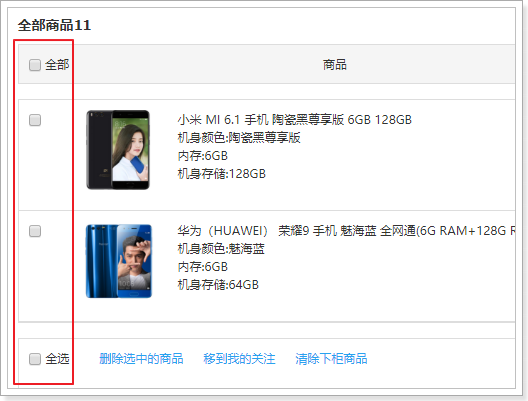

我们定义一个变量，记录所有被选中的商品：

 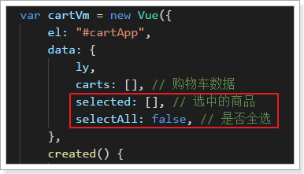


### 3.8.1.选中一个

我们给商品前面的复选框与selected绑定，并且指定其值为当前购物车商品：

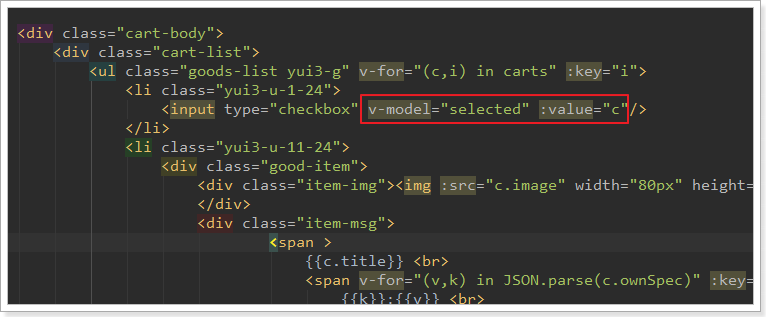

### 3.8.2.初始化全选

我们在加载完成购物车查询后，初始化全选：

 


### 3.8.4.总价格

然后编写一个计算属性，计算出选中商品总价格：

```js
computed: {
    totalPrice() {
        return this.selected.map(c => c.num * c.price).reduce((p1, p2) => p1 + p2, 0);
    }
}
```

在页面中展示总价格：

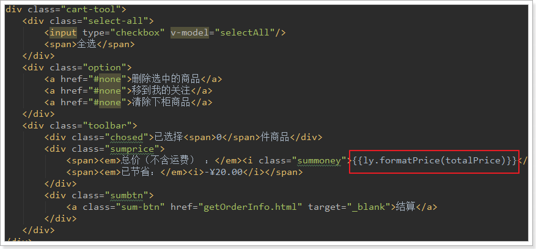

效果：

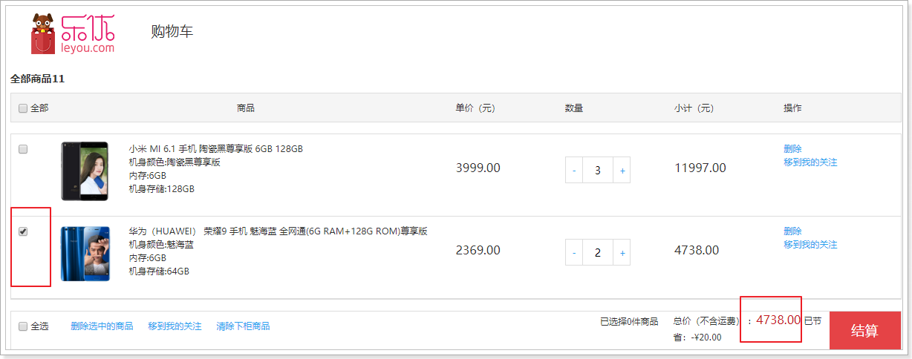

# 4.已登录购物车

接下来，我们完成已登录购物车。

在刚才的未登录购物车编写时，我们已经预留好了编写代码的位置，逻辑也基本一致。

## 4.1.添加登录校验

购物车系统只负责登录状态的购物车处理，因此需要添加登录校验，我们通过JWT鉴权即可实现。

### 4.1.1.引入JWT相关依赖

我们引入之前写的鉴权工具：`ly-auth-common`

```xml
<dependency>
    <groupId>com.leyou.service</groupId>
    <artifactId>ly-auth-common</artifactId>
    <version>1.0.0-SNAPSHOT</version>
</dependency>
```

### 4.1.2.配置公钥

```yaml
ly:
  jwt:
    pubKeyPath: D:/heima/rsa/rsa.pub # 公钥地址
    cookieName: LY_TOKEN # cookie的名称
```

### 4.1.3.加载公钥

 

代码：

```java
@ConfigurationProperties(prefix = "ly.jwt")
public class JwtProperties {

    private String pubKeyPath;// 公钥

    private PublicKey publicKey; // 公钥

    private String cookieName;

    private static final Logger logger = LoggerFactory.getLogger(JwtProperties.class);

    @PostConstruct
    public void init(){
        try {
            // 获取公钥和私钥
            this.publicKey = RsaUtils.getPublicKey(pubKeyPath);
        } catch (Exception e) {
            logger.error("初始化公钥失败！", e);
            throw new RuntimeException();
        }
    }

    public String getPubKeyPath() {
        return pubKeyPath;
    }

    public void setPubKeyPath(String pubKeyPath) {
        this.pubKeyPath = pubKeyPath;
    }

    public PublicKey getPublicKey() {
        return publicKey;
    }

    public void setPublicKey(PublicKey publicKey) {
        this.publicKey = publicKey;
    }

    public String getCookieName() {
        return cookieName;
    }

    public void setCookieName(String cookieName) {
        this.cookieName = cookieName;
    }
}
```


### 4.1.4.编写过滤器

因为很多接口都需要进行登录，我们直接编写SpringMVC拦截器，进行统一登录校验。同时，我们还要把解析得到的用户信息保存起来，以便后续的接口可以使用。

 

代码：

```java
public class LoginInterceptor extends HandlerInterceptorAdapter {

    private JwtProperties jwtProperties;

    // 定义一个线程域，存放登录用户
    private static final ThreadLocal<UserInfo> tl = new ThreadLocal<>();

    public LoginInterceptor(JwtProperties jwtProperties) {
        this.jwtProperties = jwtProperties;
    }

    @Override
    public boolean preHandle(HttpServletRequest request, HttpServletResponse response, Object handler) throws Exception {
        // 查询token
        String token = CookieUtils.getCookieValue(request, "LY_TOKEN");
        if (StringUtils.isBlank(token)) {
            // 未登录,返回401
            response.setStatus(HttpStatus.UNAUTHORIZED.value());
            return false;
        }
        // 有token，查询用户信息
        try {
            // 解析成功，证明已经登录
            UserInfo user = JwtUtils.getInfoFromToken(token, jwtProperties.getPublicKey());
            // 放入线程域
            tl.set(user);
            return true;
        } catch (Exception e){
            // 抛出异常，证明未登录,返回401
            response.setStatus(HttpStatus.UNAUTHORIZED.value());
            return false;
        }

    }

    @Override
    public void afterCompletion(HttpServletRequest request, HttpServletResponse response, Object handler, Exception ex) throws Exception {
        tl.remove();
    }

    public static UserInfo getLoginUser() {
        return tl.get();
    }
}
```

注意：

- 这里我们使用了`ThreadLocal`来存储查询到的用户信息，线程内共享，因此请求到达`Controller`后可以共享User
- 并且对外提供了静态的方法：`getLoginUser()`来获取User信息


### 4.1.5.配置过滤器

配置SpringMVC，使过滤器生效：

 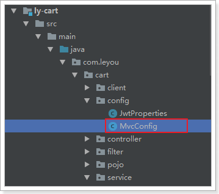

```java
@Configuration
@EnableConfigurationProperties(JwtProperties.class)
public class MvcConfig implements WebMvcConfigurer {

    @Autowired
    private JwtProperties jwtProperties;

    @Bean
    public LoginInterceptor loginInterceptor() {
        return new LoginInterceptor(jwtProperties);
    }

    @Override
    public void addInterceptors(InterceptorRegistry registry) {
        registry.addInterceptor(loginInterceptor()).addPathPatterns("/**");
    }
}
```


## 4.2.后台购物车设计

### 数据结构设计

当用户登录时，我们需要把购物车数据保存到后台，可以选择保存在数据库。但是购物车是一个读写频率很高的数据。因此我们这里选择读写效率比较高的Redis作为购物车存储。

Redis有5种不同数据结构，这里选择哪一种比较合适呢？

- 首先不同用户应该有独立的购物车，因此购物车应该以用户的作为key来存储，Value是用户的所有购物车信息。这样看来基本的`k-v`结构就可以了。
- 但是，我们对购物车中的商品进行增、删、改操作，基本都需要根据商品id进行判断，为了方便后期处理，我们的购物车也应该是`k-v`结构，key是商品id，value才是这个商品的购物车信息。

综上所述，我们的购物车结构是一个双层Map：Map<String,Map<String,String>>

- 第一层Map，Key是用户id
- 第二层Map，Key是购物车中商品id，值是购物车数据

### 实体类

```java
public class Cart {
    private Long userId;// 用户id
    private Long skuId;// 商品id
    private String title;// 标题
    private String image;// 图片
    private Long price;// 加入购物车时的价格
    private Integer num;// 购买数量
    private String ownSpec;// 商品规格参数

    public Long getUserId() {
        return userId;
    }

    public void setUserId(Long userId) {
        this.userId = userId;
    }

    public Long getSkuId() {
        return skuId;
    }

    public void setSkuId(Long skuId) {
        this.skuId = skuId;
    }

    public String getTitle() {
        return title;
    }

    public void setTitle(String title) {
        this.title = title;
    }

    public String getImage() {
        return image;
    }

    public void setImage(String image) {
        this.image = image;
    }

    public Long getPrice() {
        return price;
    }

    public void setPrice(Long price) {
        this.price = price;
    }

    public Integer getNum() {
        return num;
    }

    public void setNum(Integer num) {
        this.num = num;
    }

    public String getOwnSpec() {
        return ownSpec;
    }

    public void setOwnSpec(String ownSpec) {
        this.ownSpec = ownSpec;
    }
}
```


## 4.3.添加商品到购物车

### 4.3.1.页面发起请求：

已登录情况下，向后台添加购物车：

 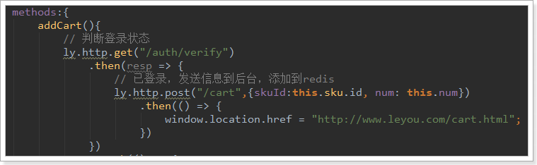

这里发起的是Json请求。那么我们后台也要以json接收。

### 4.3.2.后台添加购物车

#### controller

先分析一下：

- 请求方式：新增，肯定是Post
- 请求路径：/cart ，这个其实是Zuul路由的路径，我们可以不管
- 请求参数：Json对象，包含skuId和num属性
- 返回结果：无

```java
@RequestMapping
public class CartController {

    @Autowired
    private CartService cartService;

    /**
     * 添加购物车
     *
     * @return
     */
    @PostMapping
    public ResponseEntity<Void> addCart(@RequestBody Cart cart) {
        this.cartService.addCart(cart);
        return ResponseEntity.ok().build();
    }
}
```

#### Service

这里我们不访问数据库，而是直接操作Redis。基本思路：

- 先查询之前的购物车数据
- 判断要添加的商品是否存在
  - 存在：则直接修改数量后写回Redis
  - 不存在：新建一条数据，然后写入Redis

代码：

```java
@Service
public class CartService {

    @Autowired
    private StringRedisTemplate redisTemplate;

    @Autowired
    private GoodsClient goodsClient;

    static final String KEY_PREFIX = "ly:cart:uid:";

    static final Logger logger = LoggerFactory.getLogger(CartService.class);

    public void addCart(Cart cart) {
        // 获取登录用户
        UserInfo user = LoginInterceptor.getLoginUser();
        // Redis的key
        String key = KEY_PREFIX + user.getId();
        // 获取hash操作对象
        BoundHashOperations<String, Object, Object> hashOps = this.redisTemplate.boundHashOps(key);
        // 查询是否存在
        Long skuId = cart.getSkuId();
        Integer num = cart.getNum();
        Boolean boo = hashOps.hasKey(skuId.toString());
        if (boo) {
            // 存在，获取购物车数据
            String json = hashOps.get(skuId.toString()).toString();
            cart = JsonUtils.parse(json, Cart.class);
            // 修改购物车数量
            cart.setNum(cart.getNum() + num);
        } else {
            // 不存在，新增购物车数据
            cart.setUserId(user.getId());
            // 其它商品信息， 需要查询商品服务
            ResponseEntity<Sku> resp = this.goodsClient.querySkuById(skuId);
            if (resp.getStatusCode() != HttpStatus.OK || !resp.hasBody()) {
                logger.error("添加购物车的商品不存在：skuId:{}", skuId);
                throw new RuntimeException();
            }
            Sku sku = resp.getBody();
            cart.setImage(StringUtils.isBlank(sku.getImages()) ? "" : StringUtils.split(sku.getImages(), ",")[0]);
            cart.setPrice(sku.getPrice());
            cart.setTitle(sku.getTitle());
            cart.setOwnSpec(sku.getOwnSpec());
        }
        // 将购物车数据写入redis
        hashOps.put(cart.getSkuId().toString(), JsonUtils.serialize(cart));
    }
}

```


### 4.3.3.结果：

 


## 4.4.查询购物车

### 4.4.1.页面发起请求

 

### 4.4.2.后台实现

> Controller

```java
/**
 * 查询购物车列表
 *
 * @return
 */
@GetMapping
public ResponseEntity<List<Cart>> queryCartList() {
    List<Cart> carts = this.cartService.queryCartList();
    if (carts == null) {
        return ResponseEntity.status(HttpStatus.NOT_FOUND).body(null);
    }
    return ResponseEntity.ok(carts);
}
```

> Service

```java
public List<Cart> queryCartList() {
        // 获取登录用户
        UserInfo user = LoginInterceptor.getLoginUser();

        // 判断是否存在购物车
        String key = KEY_PREFIX + user.getId();
        if(!this.redisTemplate.hasKey(key)){
            // 不存在，直接返回
            return null;
        }
        BoundHashOperations<String, Object, Object> hashOps = this.redisTemplate.boundHashOps(key);
        List<Object> carts = hashOps.values();
        // 判断是否有数据
        if(CollectionUtils.isEmpty(carts)){
            return null;
        }
        // 查询购物车数据
        return carts.stream().map(o -> JsonUtils.parse(o.toString(), Cart.class)).collect(Collectors.toList());
    }
```


### 4.4.3.测试

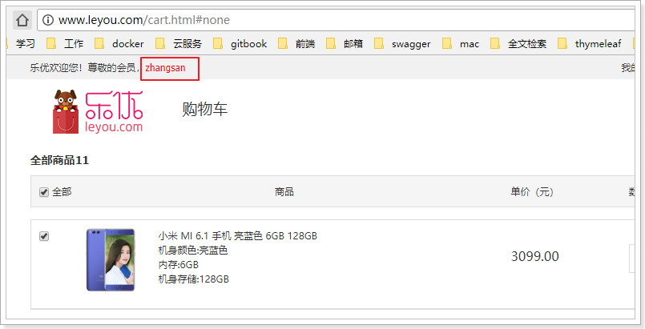


## 4.5.修改商品数量

### 4.5.1.页面发起请求

 

### 4.5.2.后台实现

> Controller

```java
@PutMapping
public ResponseEntity<Void> updateNum(@RequestParam("skuId") Long skuId, 
                                      @RequestParam("num") Integer num) {
    this.cartService.updateNum(skuId, num);
    return ResponseEntity.ok().build();
}
```

> Service

```java
public void updateNum(Long skuId, Integer num) {
    // 获取登录用户
    UserInfo user = LoginInterceptor.getLoginUser();
    String key = KEY_PREFIX + user.getId();
    BoundHashOperations<String, Object, Object> hashOps = this.redisTemplate.boundHashOps(key);
    // 获取购物车
    String json = hashOps.get(skuId.toString()).toString();
    Cart cart = JsonUtils.parse(json, Cart.class);
    cart.setNum(num);
    // 写入购物车
    hashOps.put(skuId.toString(), JsonUtils.serialize(cart));
}
```

## 4.6.删除购物车商品

### 4.6.1.页面发起请求

 

注意：后台成功响应后，要把页面的购物车中数据也删除

### 4.6.2.后台实现

> Controller

```java
@DeleteMapping("{skuId}")
public ResponseEntity<Void> deleteCart(@PathVariable("skuId") String skuId) {
    this.cartService.deleteCart(skuId);
    return ResponseEntity.ok().build();
}
```


> Service

```java
public void deleteCart(String skuId) {
    // 获取登录用户
    UserInfo user = LoginInterceptor.getLoginUser();
    String key = KEY_PREFIX + user.getId();
    BoundHashOperations<String, Object, Object> hashOps = this.redisTemplate.boundHashOps(key);
    hashOps.delete(skuId);
}
```


# 5.登录后购物车合并（作业）

当跳转到购物车页面，查询购物车列表前，需要判断用户登录状态，

- 如果登录：
  - 首先检查用户的LocalStorage中是否有购物车信息，
  - 如果有，则提交到后台保存，
  - 清空LocalStorage
- 如果未登录，直接查询即可


